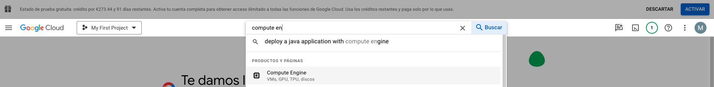
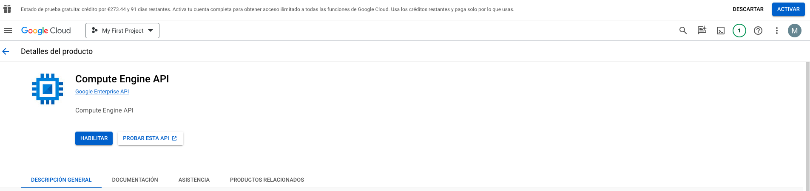
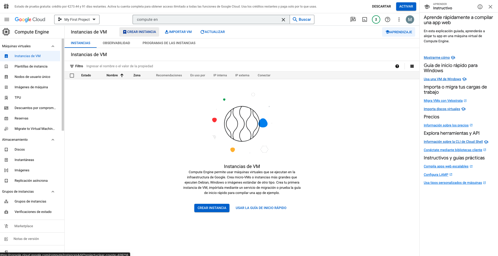
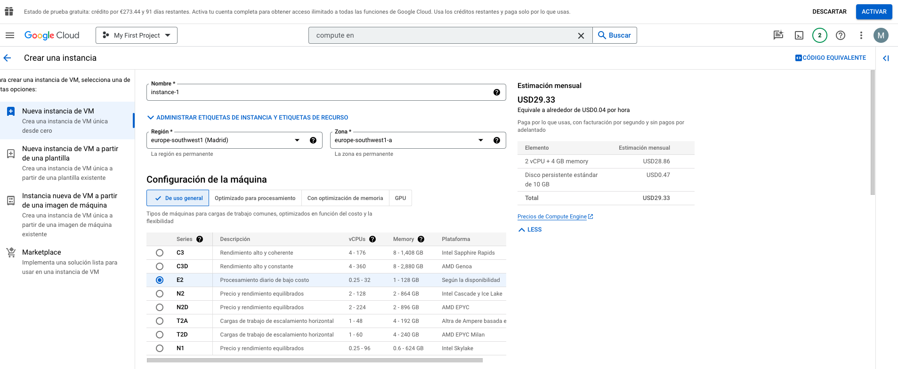
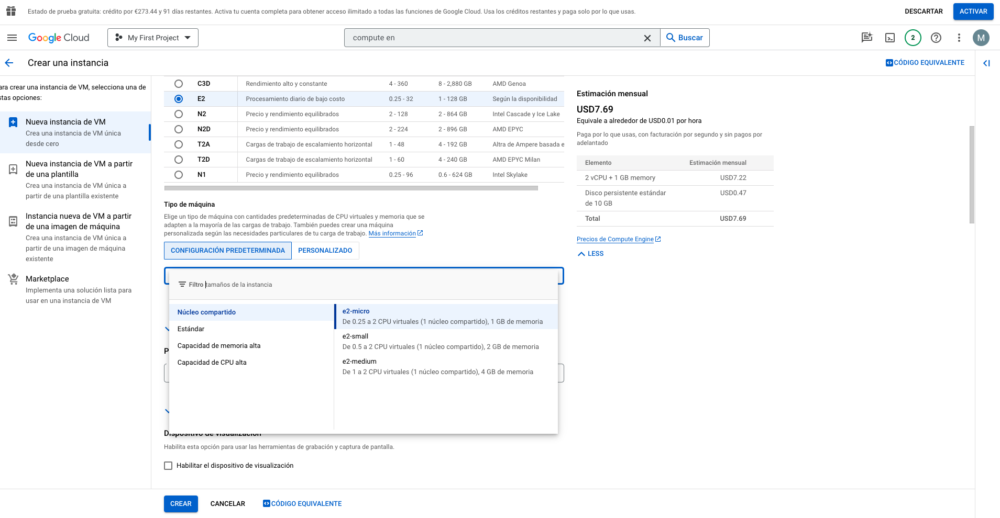
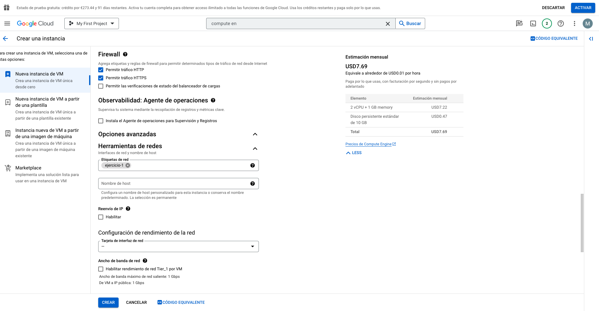

# GCP Setup Requirements

## Create a GCP Account
To create a GCP Account, go to the following link:
- [Google Cloud Platform - Free trial](https://console.cloud.google.com/freetrial)

And follow the steps to create your account and get 300€ in credit to use during 3 months


### Create your first resource: Compute Engine

Compute Engine is a service that provides virtual machines that run on Google infrastructure. Compute Engine offers scale, performance, and value that allows you to easily launch large compute clusters on Google's infrastructure. There are no upfront investments and you can run thousands of virtual CPUs on a system that has been designed to be fast, and to offer strong consistency of performance.

To create and manage your virtual machines, you can use Google Cloud CLI or the web UI. In this exercise, you will use first the web UI.

### Create a Compute Engine instance

1. In the GCP Console, go to the VM Instances page.
   
   

2. Activate the Compute Engine API if it is not already activated.
   
   

3. Click Create instance.
   
    

4. Select the region as europe-southwest1 (Madrid) and the zone as europe-southwest1-a.
   
    

5. In the type of machine, select the machine type as e2-micro.
   
    

5. In the Firwall section, select Allow HTTP traffic and Allow HTTPS traffic. And in the advanced section, add the tag `ejercicio-1` to the network tags.
   
    


6. Leave the rest of the options as default and click Create.


Once the instance is created, we have to connect to it. We have several options:

- **SSH from the browser**: This option is only available for Linux instances. It is not available for Windows instances. It is the easiest way to connect to the instance, but it is not available for Windows instances.

- **SSH from the command line**: This option is available for both Linux and Windows instances. It is the most flexible option, but it requires to install the Cloud SDK in your local machine.

  - [Install Cloud SDK](https://cloud.google.com/sdk/docs/install)


### Use of gcloud CLI to create and manage instances

- Login to your account
```bash
gcloud auth login
```

- Set the project
```bash
gcloud config set project <PROJECT_ID>
```

- Create a new instance
```bash
gcloud compute instances create <INSTANCE_NAME> --zone=<ZONE> --machine-type=<TYPE> --image=<IMAGE>
```

For example, for a e2-micro instance in europe-southwest1-a (Madrid) zone:
```bash
gcloud compute instances create <INSTANCE-NAME> \
  --zone=europe-southwest1-a \
  --machine-type=e2-micro \
  --image-project=debian-cloud \
  --image=debian-12-bookworm-v20241210 \
  --boot-disk-size=10GB
```

- List the instances
```bash
gcloud compute instances list
```

- SSH to the instance
```bash
gcloud compute ssh <INSTANCE_NAME> --zone=<ZONE>
```

- Copy files and folders to the instance
```bash
gcloud compute scp <SOURCE> <INSTANCE_NAME>:<DESTINATION> --zone=<ZONE>
```

- Delete an instance
```bash
gcloud compute instances delete <INSTANCE_NAME> --zone=<ZONE>
```
