# ENTREGABLE AWS E2E


En este documento, se quiere mostrar todos los pasos seguidos para desplegar una infraestructura en AWS, de manera manual, mediante la UI.

En primer lugar, se crea una base transaccional PostgresSQL en AWS RDS, esta la llamamos como database-1.

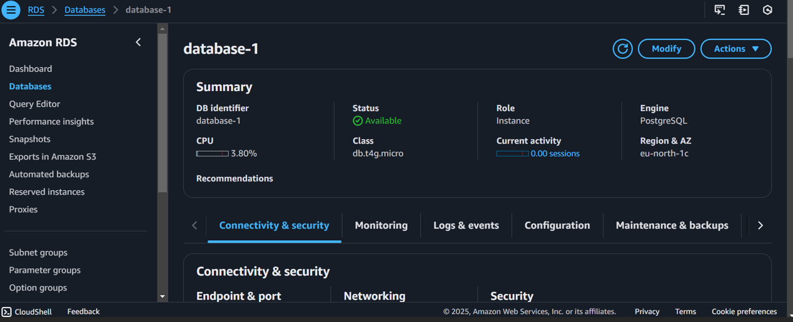

Para poder visualizar los datos de `initial_info.py` en RDS,a partir del `rds_e2e.py` usaremos DBEAVER. Aquí introduciremos el host de RDS, nombre de la database, nombre de usuario y contraseña.

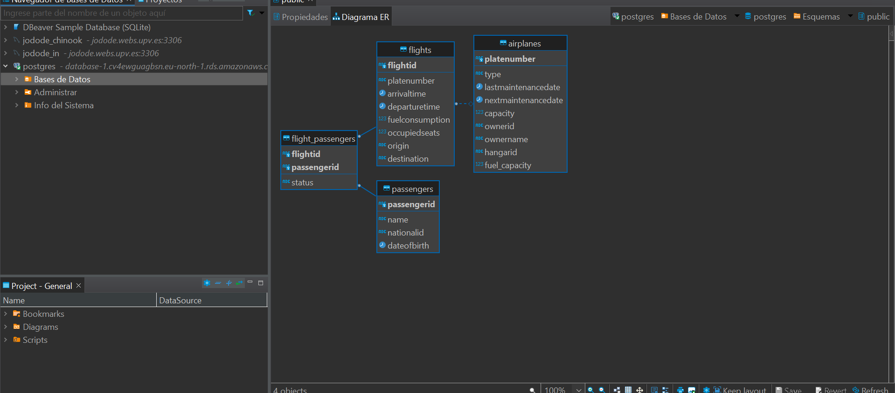


El siguiente paso, será una crear una EL que lleve la información de nuestra base de datos transaccional (RDS) a una analítica (Redshift).

- Para ello, creamos en Redshift un Workgroup y un Namespace, introducimos un nombre de usuario, una contraseña y tenemos nuestro Redshift.

- Solo faltaría ejecutar el `redshift_etl.py`

    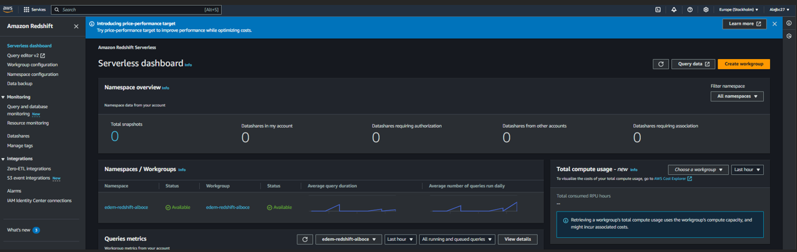


A continuación, se creará una EL que lleve la información de `initial_info.py` a un data lakehouse usando Iceberg, S3 y Glue.

- Primero se creará el Bucket S3, llamado alboce-edem-e2e

    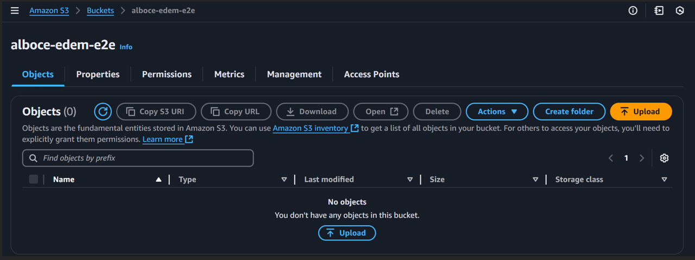

- Luego, se crea la Database y Table de Glue, llamadas db_e2e y table-e2e respectivamente. 

    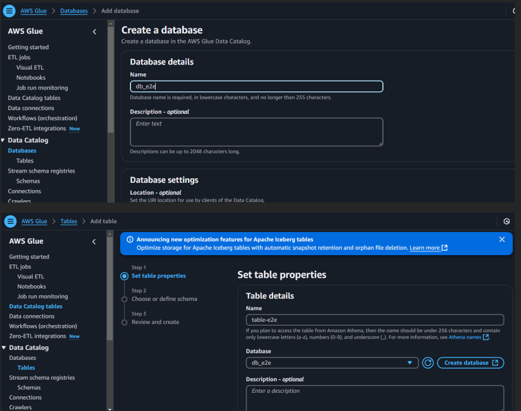

- Una vez están creadas, podemos ejecutar el `iceberg_create_insert.py`, que nos insterta las tablas de los diferentes datos.

  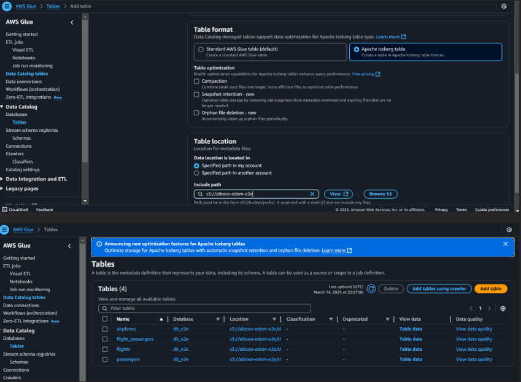


- Se puede usar Athena, para ver lo que existe en el iceberg (tablas) que hemos creado e introducido datos, a modo de un tipo de "consulta SQL"
  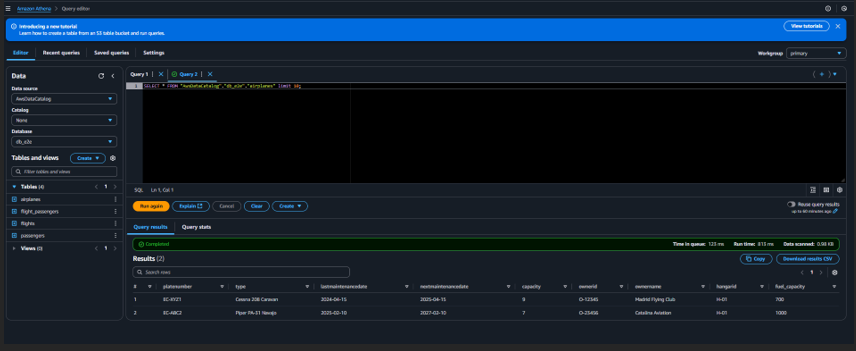


Como paso final, se va a dockerizar el código realizado y deplegarlo en una EC2.

Para ello, se crea la máquina Ubuntu e instancias free tier, se introduce la key .pem, esto nos permite identificarnos de manera segura en las instancias EC2.

A continuación, vamos a security y se abren los puertos 5432 y 5439, para que la EC2, pueda acceder a los puertos de RDS y RedShift, respectivamente.
  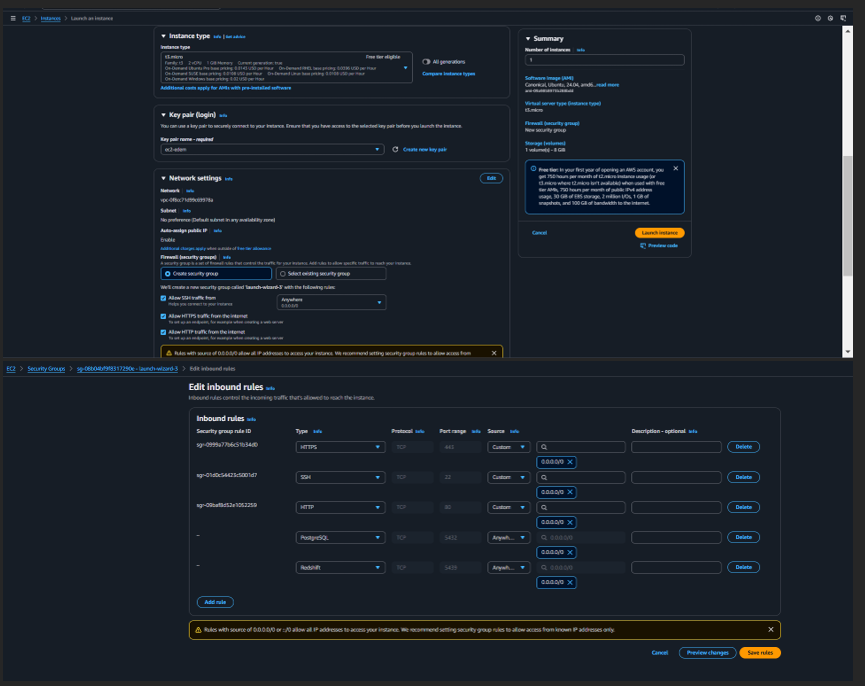

Conectamos con nuestra terminal a traves del endpoint
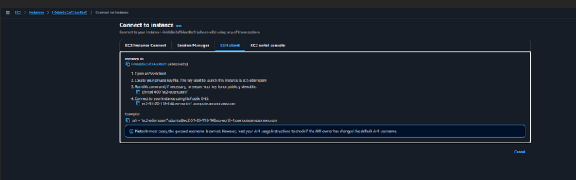

Con el comando de la primera imagen (sin aún ejecutar el comando del endpoint) nos permite pasar nuestra carpeta con todo lo que hay dentro, útil para poder ejecutar el dockerfile con los .py necesarios. 

Una vez completado, se construye la imagen, en este caso con el nombre e2e y a continuación se despliega.
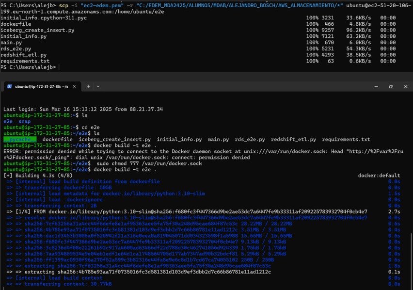

Finalmente, se ejecuta el dockerfile y se ejecutan los .py que se han usado anteriormente, tanto de RDS, RedShift y Iceberg.
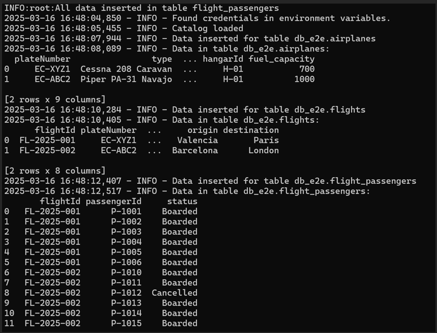


### EXTRA

He usado Kubernetes, para desplegar las aplicaciones y permitir que las EL se ejecuten cada determinado tiempo, de manera automática y sin intervencion manual.

Para ello, he creado una VM, he instalado microk8s junto a docker y he copiado mi carpeta AWS_ALMACENAMIENTO con el comando scp a esta VM.

En la carpeta kubernetes, se encuentra el dockerfile, que se ha subido a mi docker hub, junto a un deployment y service y los yaml de las diferentes apps que se encargan de las EL (cronjobs).
Importante, los secrets de los diferentes yaml, los paso con el env, con el siguiente comando: 
```bash
kubectl create secret generic aws-secrets \
  --from-env-file=.env
```

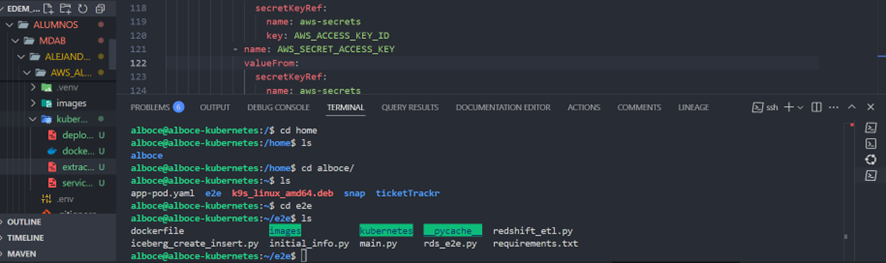

Arranco microk8s y espero a que el cluster este listo.
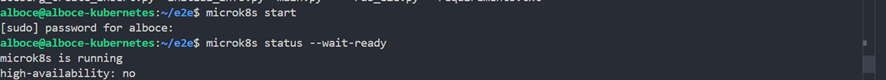

Creo un namespace, para poder tener mejor organizado y aislados diferentes recursos en el clúster
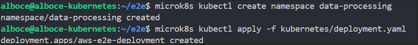

Finalmente, una vez está creado el Cronjob, he descargado k9s, para poder acceder al clúster de manera más visual.
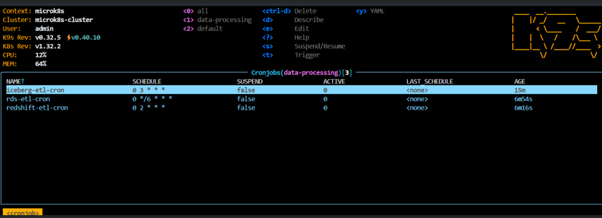


