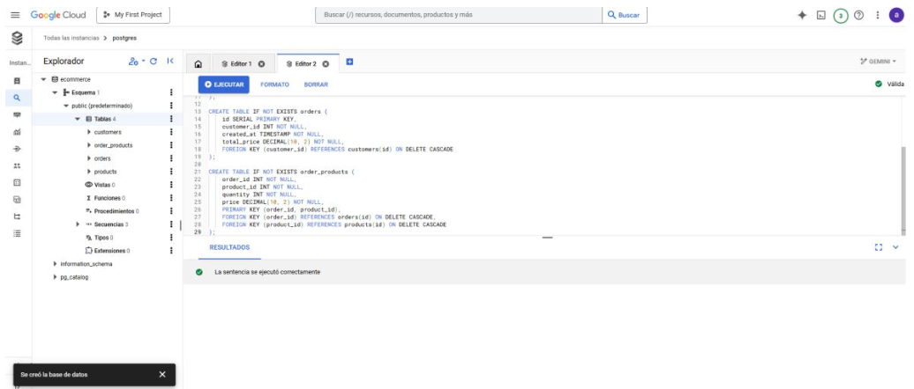
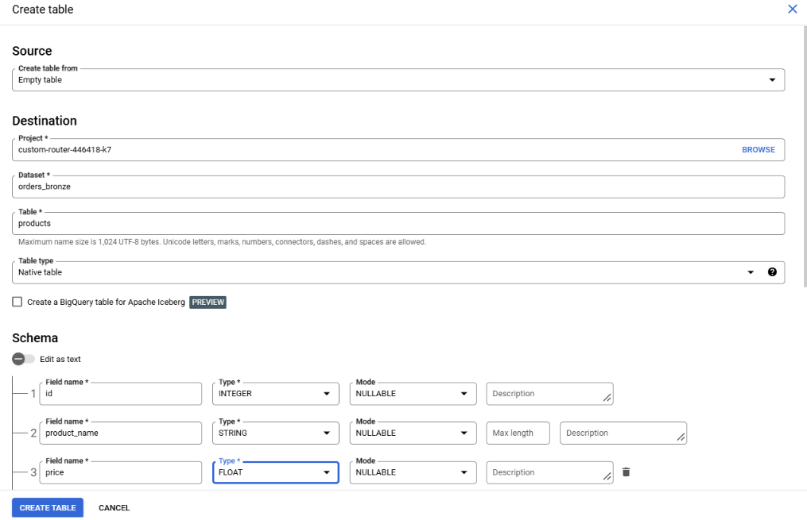

# Entregable End2End GCP Almacenamiento 

En este documento, se quiere mostrar todos los pasos seguidos para desplegar una infraestructura en GCP, de manera manual, mediante la UI.

- En primer lugar, se crean las máquinas virtuales. Para este caso, se llamarán orders-app y delivery-app. La primera se creará manualmente, con región en europe-west1 (Bélgica), serie E2 micro y firewall abierto para los protocolos HTTP y HTTPS. El proceso de creación de delivery-app es similar, solo que ahora, en vez de hacerlo manualmente, se ha hecho mediante comando. Para ello, se ha creado mediante una imagen de orders-app, con las mismas dependencias instaladas (versiones de Python y Docker). Luego, se arrancan las imágenes creadas.
  

    

    

    

    

- A continuación, se han creado tanto topics como suscripciones de ambas apps (orders-app-events, orders-app-events-sub...)
  

- Luego, se procede a crear la instancia de PostgreSQL. Se introduce la configuración pertinente para el uso de esta infraestructura y se crea la red default. Una vez creada, se crea la BBDD ecommerce.

    

    

    

    

    

    

    

    

    

    - En esta parte, se hace uso del bucket creado para el Data Lake, utilizando el parquet generado.

    

    - También se aprovecha para crear la capa medallón. 

    

- En esta parte, se crea una nueva subscripción, para nuestra capa analítica, que será con BigQuery. 

    

- Aquí, desplegamos la parte de EL del pipeline para sincronizar la BBDD PostgreSQL con BigQuery. Para ello, creamos las credenciales por defecto con nuestra aplicación, permitiendo identificar los servicios de GCP con nuestra cuenta de usuario.
  

  

- En esta parte, se inician ambas máquinas (orders y delivery) y empiezan a generar mensajes.

  

  

-  A continuación, se ejecuta el script de DBT en local. Luego, se crea la vista en BQ del modelo **gold**.

  

  

- Finalmente se realiza un dashboard con Metabase, para ello se crea una **SA**, con los permisos de:
  - BigQuery Data Viewer (roles/bigquery.dataViewer) → Para leer datos.
  - BigQuery Job User (roles/bigquery.jobUser) → Para ejecutar consultas.
  - BigQuery Metadata Viewer (roles/bigquery.metadataViewer) → Para ver esquemas y tablas.

  

  

### Propuesta 1

  - Esta parte extra del e2e corresponde a la de añadir un nuevo tópico y suscriptor en Pub/Sub desde Orders App.
  En este caso, he optado por añadir un backup de orders-events.

  - Para ello, añado el código que se ve en las imágenes, para que cuando genere datos, se envien a ese tópico y subscriptor.
    - Destacar, que para ello, se ha editado el código de orders con VIM de la instancia, para añadir el código que se muestra.

  

  

  

### Propuesta 2

  - En esta parte, se ha añadido una **nueva app**, llamada **customer-service-app**
  - Para ello he creado una nueva VM, con el template de imágen que ya había.
  - Finalmente, se enciende la máquina, se configura, y se añade la carpeta con VIM de la nueva app, junto a su nuevo código para que envie a la nueva tabla.
  - Se crea un nuevo topic, junto a nueva subscripción que escribirá directamente a BigQuery los mensajes recibidos.

  

  

  

  

  
