## GCP ENTREGABLE

### Compute Engine

- Creación de las máquinas virtuales `orders-app` y `delivery-app`:

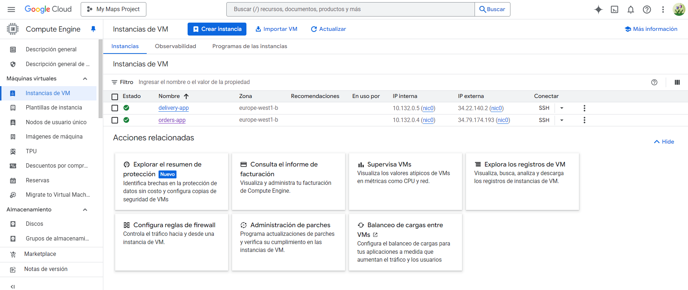

---

### Cloud SQL

- Creación de la instancia Cloud SQL con PostgreSQL:

 
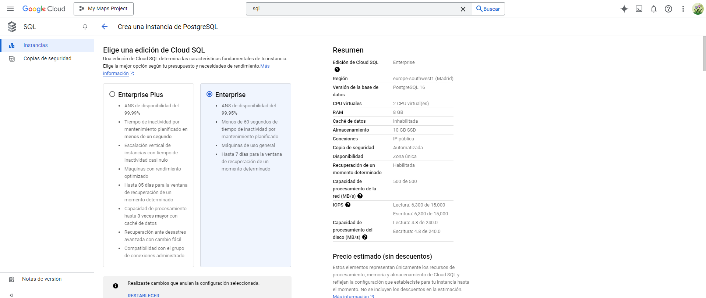

- Creación de la base de datos `ecommerce`:

 
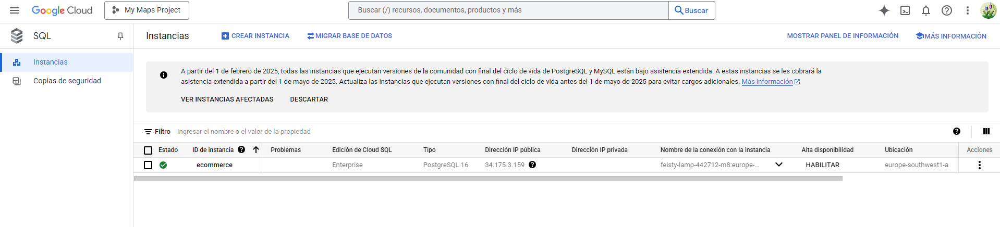

 
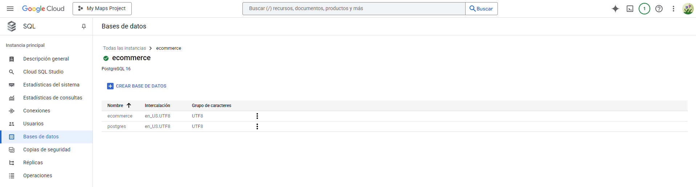

- Ejecución de queries para crear tablas en la base de datos:

 
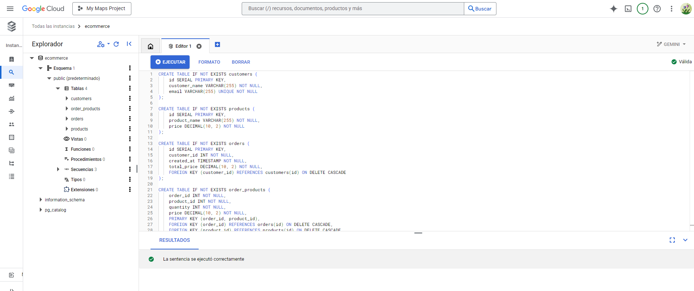

---

### BigQuery

- Creación de los datasets `orders`, `delivery` y creación de tablas:

 
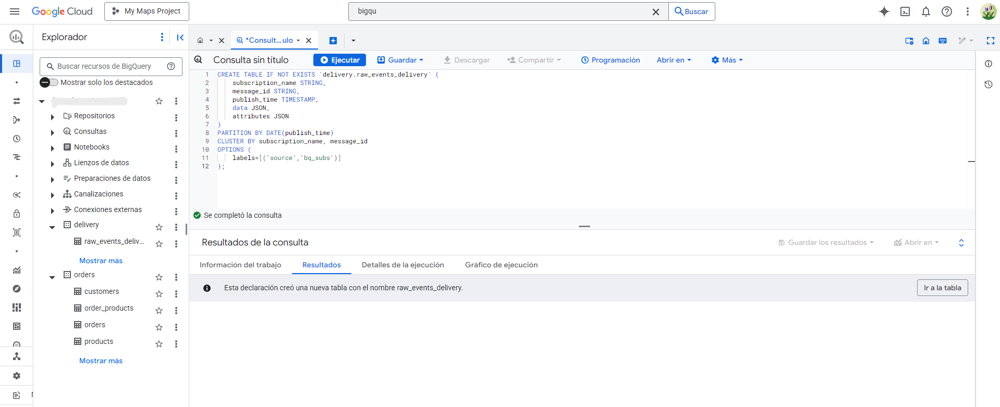

---

### Pub/Sub

- Creación de topicos:

 
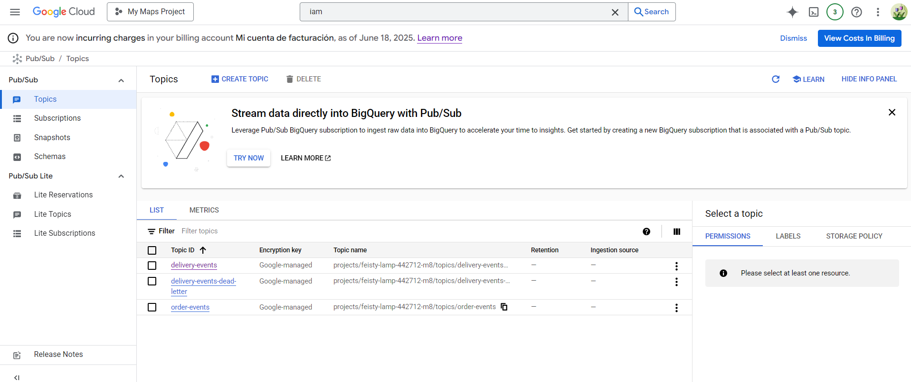

- Creación de suscripciones:

 
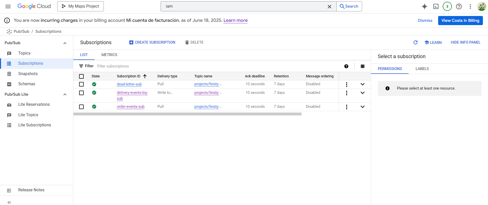

---

### Bucket de Cloud Storage

- Creación del bucket para almacenar archivos `.parquet`:

 
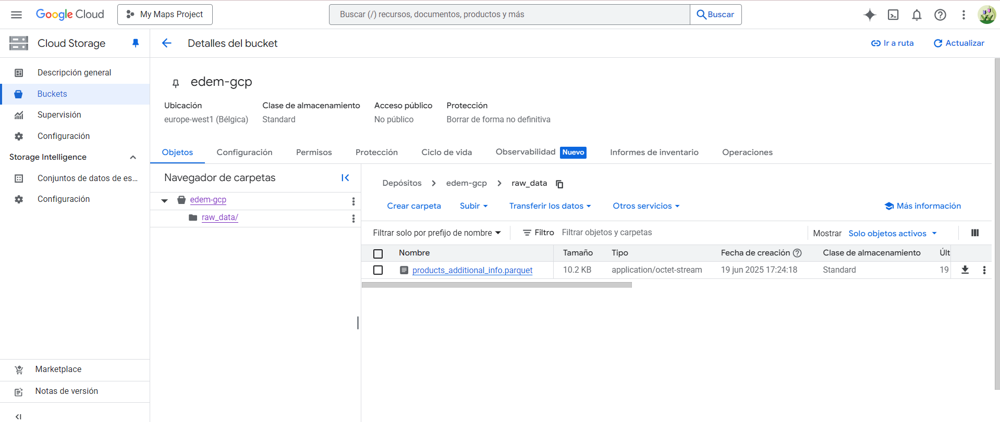

---

## 2. Ejecución del sistema

 
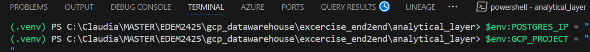

 
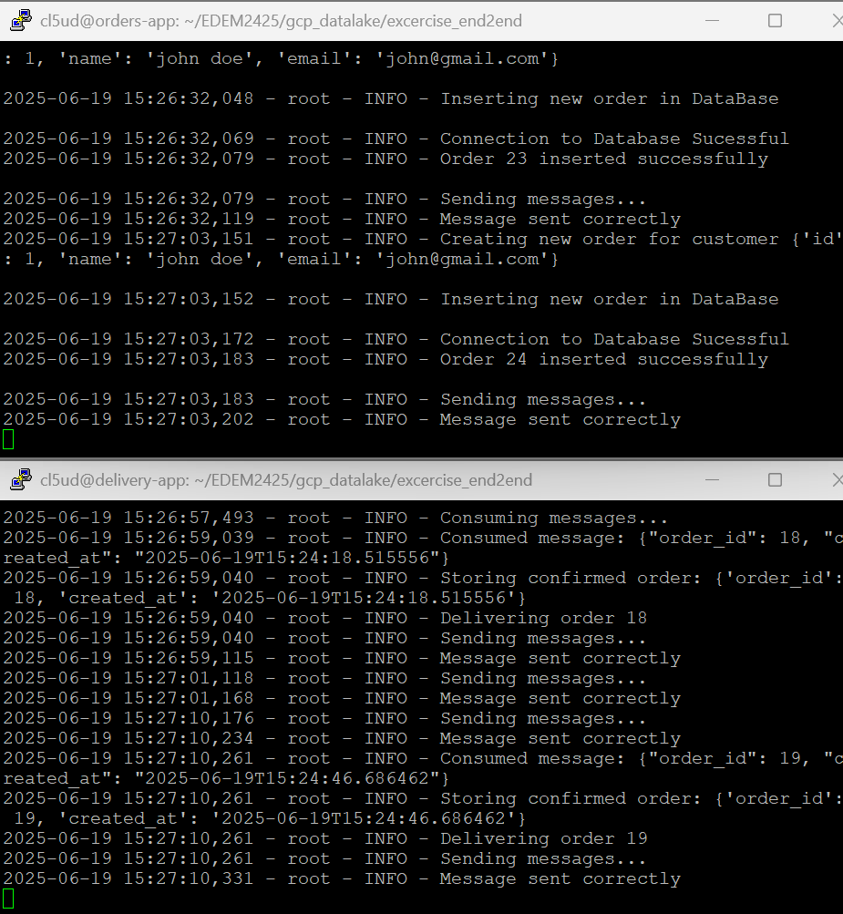

---

## 3. Sincronización con BigQuery (Analytical Layer)

- Configuración de variables y ejecución del script para sincronizar PostgreSQL con BigQuery:

 
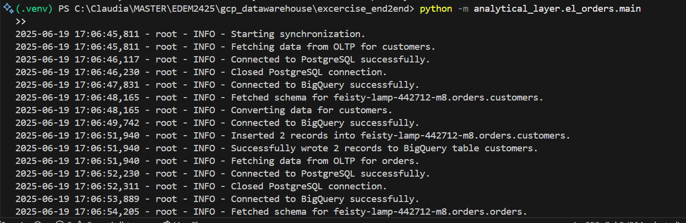

---

## 4. DBT

- Configuración y ejecución de dbt para transformar datos en BigQuery:

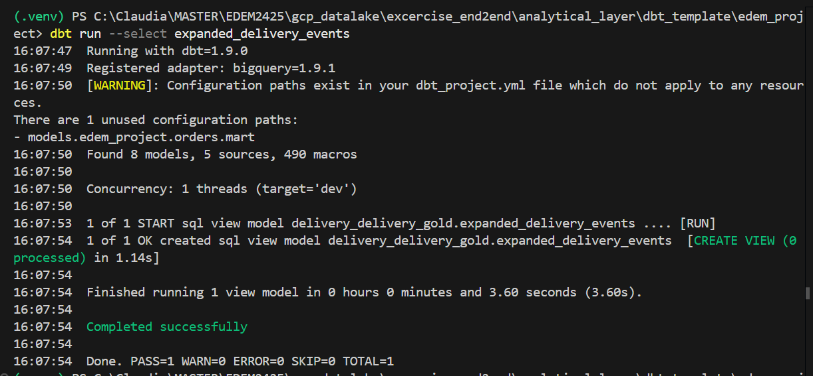

---

## 5. Visualización en Metabase

- Uso de docker-compose para levantar Metabase y conectar los datasets:

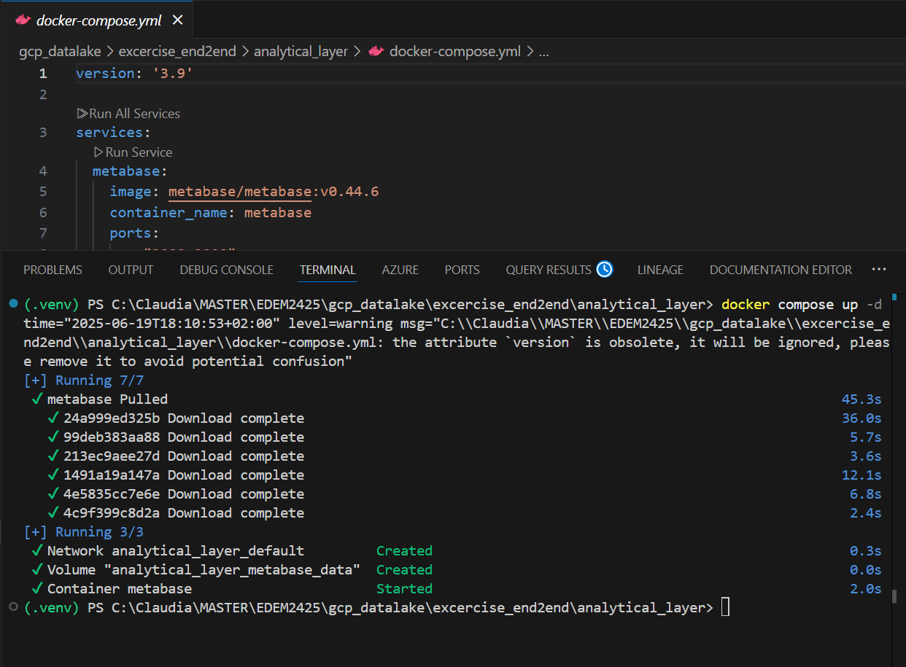

- Ejemplos de dashboards:

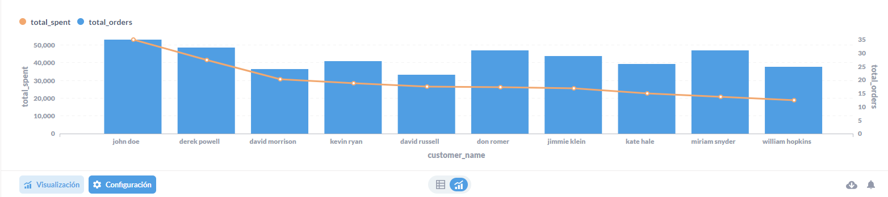
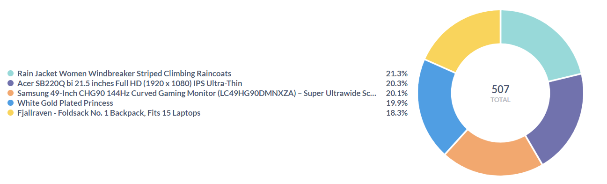

