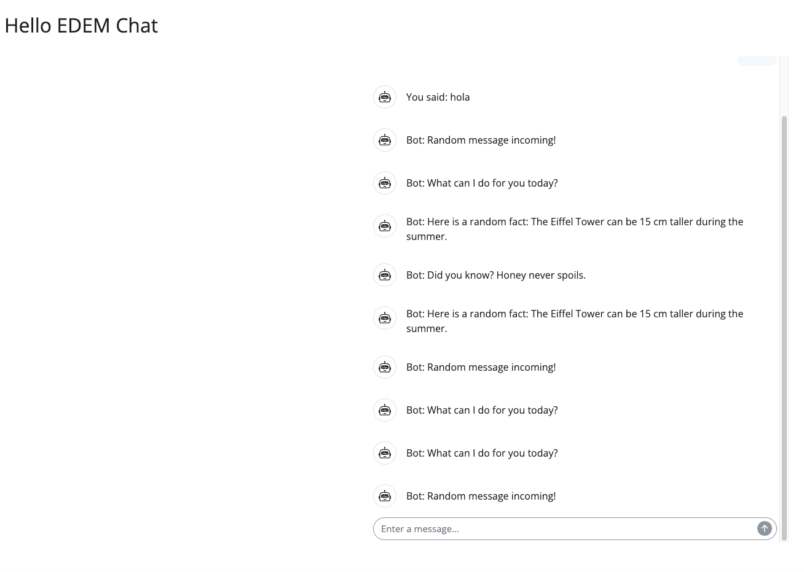
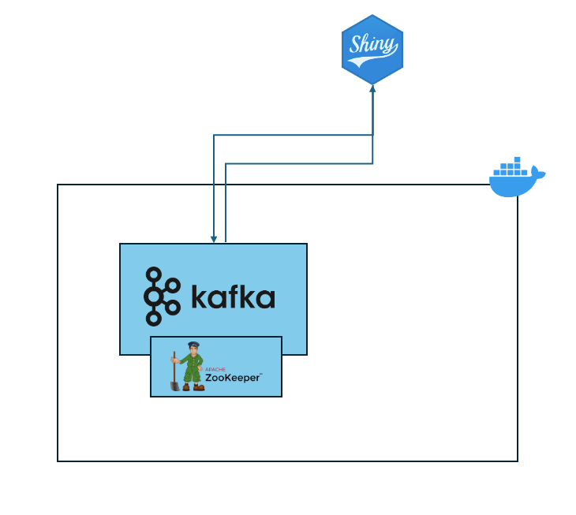
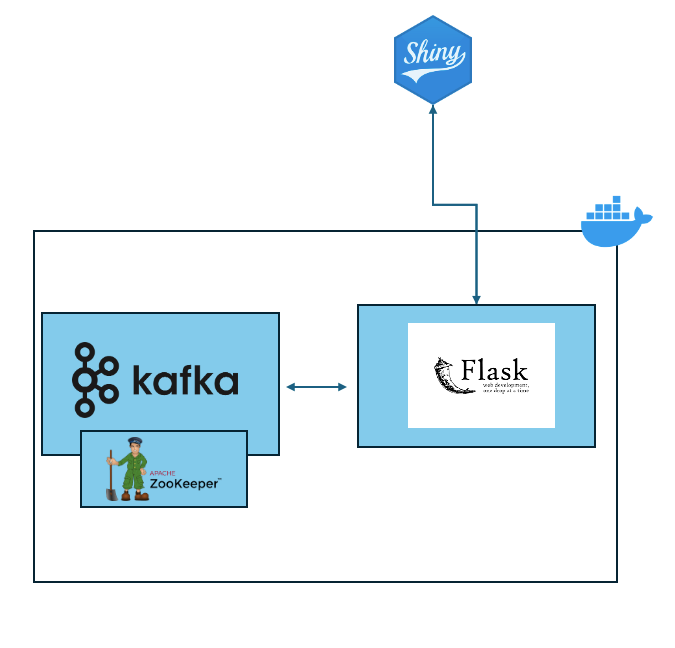
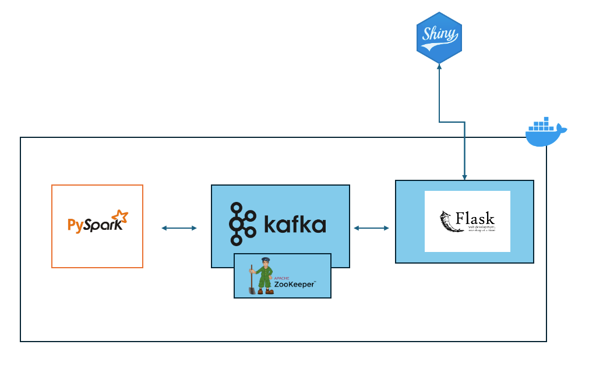
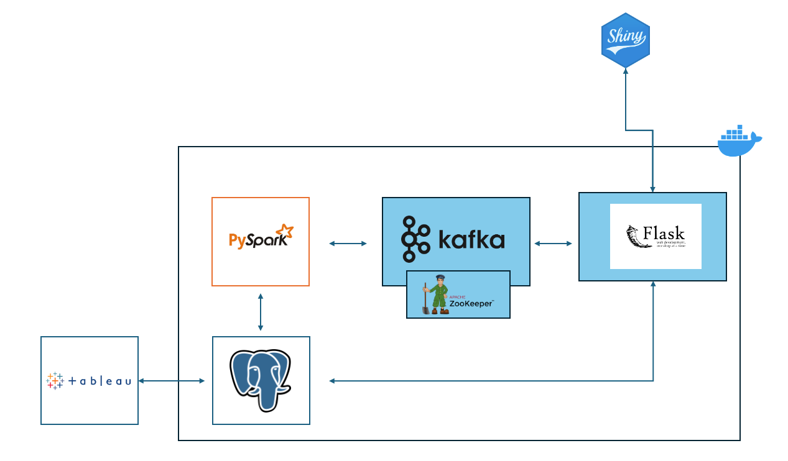

# Bienvenidos al reto de Chat Big Data

El objetivo de este ejercicio es poner en práctica los conocimientos adquiridos en la asignatura de Big Data. Para ello, deberéis implementar un chat en tiempo real utilizando Apache Kafka como broker de mensajes. Para ello deberéis implementar varios interlocutores que se comunicarán entre sí a través de un topic de Kafka.

Pero antes de lanzarnos a la piscina, arranquemos nuestro proyecto inicial del que partirá este reto. Para ello, debéis seguir los siguientes pasos:

1. Clona el repositorio de la asignatura en tu máquina local
2. Crea una rama con tu nombre y apellidos
3. Copia el contenido de la carpeta `CHATBIG` a tu carpeta de alumno
4. Ejecuta los siguientes comandos:

Para este ejercicio utilizaremos la librería de chat `shiny`. Para instalarla, ejecuta el siguiente comando. 

```bash
pip install shiny
shiny run chatbot.py
```

Podéis revisar la documentación de la librería en el siguiente enlace: [https://shiny.posit.co/py/components/display-messages/chat/](https://shiny.posit.co/py/components/display-messages/chat/)

Una vez que hayas ejecutado este código deberías tener algo parecido a lo siguiente si navegas a la ruta [http://localhost:8000](http://localhost:8000)



Si habéis llegado hasta aquí estáis listos para empezar con el reto. Para mantener la arquitectura limpia he prescindido de la visualización de kafka (kafka-ui, redpandas...) pero podéis añadirlo si lo consideráis necesario.

## Fase 1 - Kafka

Arquitectura objetivo de Fase 1:



En esta fase necesitamos conseguir que nuestro chat interactúe con un topic de Kafka. Para ello, deberéis implementar un productor y un consumidor de mensajes que se comuniquen a través de un topic de Kafka al que llamaremos "chat". Para ayudaros un poco he colocado en el código dos partes donde tenéis que trabajar:

Step 1 - Enviar
Step 1 - Recibir

La estructura del mensaje debe ser la siguiente:

```json
{
    "author": "nombre_usuario",
    "data": "mensaje",
    "timestamp": "2021-10-10 10:10:10"
}
```
Una vez seáis capaces de enviar un mensaje a kafka y recibirlo en el mismo chat como un ECHO estáis listos para pasar a la siguiente fase.

## Fase 2 - API REST

Arquitectura objetivo de Fase 2:



En esta fase necesitamos conseguir que nuestro chat interactúe con un API REST. Para ello, deberéis implementar un endpoint que permita enviar mensajes a través de un API REST. Para ello debéis mover el código de envío de mensajes a Kafka a un endpoint de Flask. 

Para ello necesitamos implementar un endpoint que reciba un mensaje y lo envíe a Kafka. La estructura del mensaje debe ser la misma que en la fase anterior. Adicionalmente debemos implementar un endpoint que reciba los mensajes de Kafka y los devuelva en un formato JSON.

Una vez que hayáis conseguido implementar estos endpoints, debéis modificar el código de vuestro chat para que envíe los mensajes a través de este endpoint y dockerizar la API.

Una vez vuestra api esté corriendo la funcionalidad no variará de la solución de fase 1 pero ahora los mensajes se enviarán a través de un API REST.

## Fase 3 - PySpark

Arquitectura objetivo de Fase 3:



Una vez llegados a este punto debemos implementar un servicio de control de mensajes, para ello utilizaremos PySpark. Para ello, deberéis implementar un consumidor que se suscriba a un topic de kafka y que sea capaz de detectar mensajes que contengan palabras malsonantes. En caso de detectar una palabra malsonante, el consumidor deberá enviar un aviso al emisor del mensaje con un aviso que bloqueará al usuario si llega a 3 avisos y reemplazar la palabra malsonante por asteriscos en el mensaje al destinatario.

Para conseguir esto, debéis crear un topic secundario en kafka llamado "chat_controlled" donde se enviarán los mensajes validados. Tened en cuenta que este cambio implica que la api tenga que adaptarse a este nuevo topic.

Una vez vuestro código funcione, deberíais ser capaces de enviar mensajes a través de la api y recibirlos en el chat con las palabras malsonantes reemplazadas por asteriscos.

## Fase 4 - Gestión de Mensajes y Usuarios

Arquitectura objetivo de Fase 4:



Si habéis llegado hasta aquí, Felicidades :-) pero vamos a seguir un poco más... siempre hay más para seguir!! En esta fase crearemos un sistema para reportar estadísticas de los usuarios y los mensajes que mandan.

Para ello, crearemos una base de datos, que almacenará los mensajes de los usuarios, y un sistema de control de usuarios que bloqueará a los usuarios que envíen mensajes malsonantes. Para ello cuando un mensaje malsonante se envíe, pyspark lo insertará en la base de datos y en la siguiente llamada, la api de GET_MENSAJE deberá comprobar si ese usuario está bloqueado o no para poder interactuar con el chat.


## Reflexión Final

Si habéis llegado hasta este punto, enhorabuena! Habéis conseguido implementar un chat en tiempo real con un sistema de control de mensajes y usuarios. El objetivo de este ejercicio, como todos los E2E es que podáis ver cómo se integran las diferentes tecnologías que hemos visto en la asignatura y cómo se pueden combinar para crear un sistema completo.

Espero que no hayáis odiado mucho durante el ejercicio y que hayáis aprendido algo nuevo. Si tenéis cualquier duda, no dudéis en preguntar!!!

