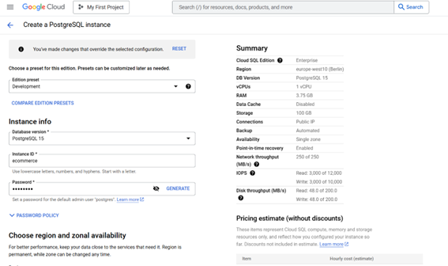

# Configuración de Infraestructura en Google Cloud Platform

Este documento detalla el proceso de configuración de una infraestructura completa en GCP para una aplicación de pedidos y entregas.

## Índice
- [Configuración de Infraestructura en Google Cloud Platform](#configuración-de-infraestructura-en-google-cloud-platform)
  - [Índice](#índice)
  - [Configuración de Máquinas Virtuales](#configuración-de-máquinas-virtuales)
    - [Orders App VM](#orders-app-vm)
    - [Delivery App VM](#delivery-app-vm)
  - [Configuración de Pub/Sub](#configuración-de-pubsub)
  - [Configuración de Base de Datos](#configuración-de-base-de-datos)
  - [Configuración de Big Query](#configuración-de-big-query)
    - [Pruebas del Sistema](#pruebas-del-sistema)
    - [Conexión con Data Lake](#conexión-con-data-lake)
  - [Implementación de dbt](#implementación-de-dbt)
  - [Visualización con Metabase](#visualización-con-metabase)

## Configuración de Máquinas Virtuales

### Orders App VM
1. Creamos una máquina virtual `orders-app` en el servidor de Bélgica con las siguientes especificaciones:
   - Tipo de máquina: e2-micro
   - Tráfico HTTP y HTTPS habilitado


2. Instalación de dependencias:
   - Docker
   - Docker-compose
   - Python
   - Clonación del repositorio de trabajo


3. Creación de imagen base:
   - Se crea una imagen de la máquina virtual configurada para automatizar el proceso
   - Nombre de la imagen: `image-e2e`


### Delivery App VM
1. Se crea una nueva máquina virtual utilizando la imagen base `image-e2e`


## Configuración de Pub/Sub

1. Creación de tópicos:
   - Tópico para orders
   - Tópico para delivery


## Configuración de Base de Datos

1. Creación de Cloud SQL:
   - Nombre de la base de datos: `ecommerce`



## Configuración de Big Query

1. Creación de datasets:
   - Se crean 2 datasets independientes
   - Configuración de tablas correspondientes


2. Configuración de suscripciones Pub/Sub:
   - Integración con Big Query para ambos tópicos


### Pruebas del Sistema

1. Creación y lectura de pedidos:
   - Verificación de funcionamiento del sistema de pedidos


2. Visualización en Cloud SQL:
   - Confirmación de almacenamiento correcto de datos


### Conexión con Data Lake

1. Creación de tabla externa en Big Query:
   - Configuración de conexión con Data Lake


## Implementación de dbt

1. Sincronización entre BigQuery y PostgreSQL:
   - Configuración de conexión bidireccional


2. Inicialización del proyecto dbt:
```bash
dbt init
```


3. Creación de vistas:
   - Implementación de templates preparados
   - Configuración de vistas personalizadas


## Visualización con Metabase

1. Despliegue de Metabase:
   - Implementación mediante Docker
   - Configuración de dashboard


