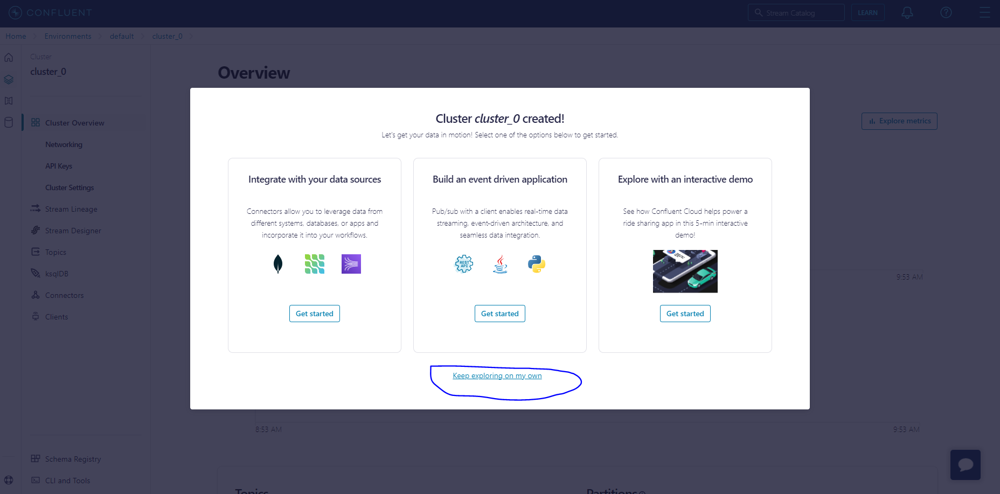

# Exercise 1: Confluent Kafka Cloud - Login

Create an account into Confluent Kafka Cloud.

## Confluent Cloud

**Steps:**

1. Create a Confluent Cloud account. You can use the free trial, which will be enough for this excercise. You can create an account [here](https://confluent.cloud/signup). We will use the Sign Up with Google option, but you can choose whichever you prefer.
   

2. Provide your full name and as a company write "EDEM" or "GFT". Click on Next.
 

3. In the next screen, select the options that describe your expertise with Kafka best. Click on Next.
   

4. Now we can configure the cluster that will be used for this excercise. Choose Google Cloud as the cloud provided and Madrid as the region. Leave the name as "cluster_0". Click on Next.
   

5. The next screen is for configuring the billing. However, you **don't need to include any payment information**. Just click on Skip at the bottom left of the screen.
   

6. Now the environment is created and you can click on "keep exploring on my own".
   