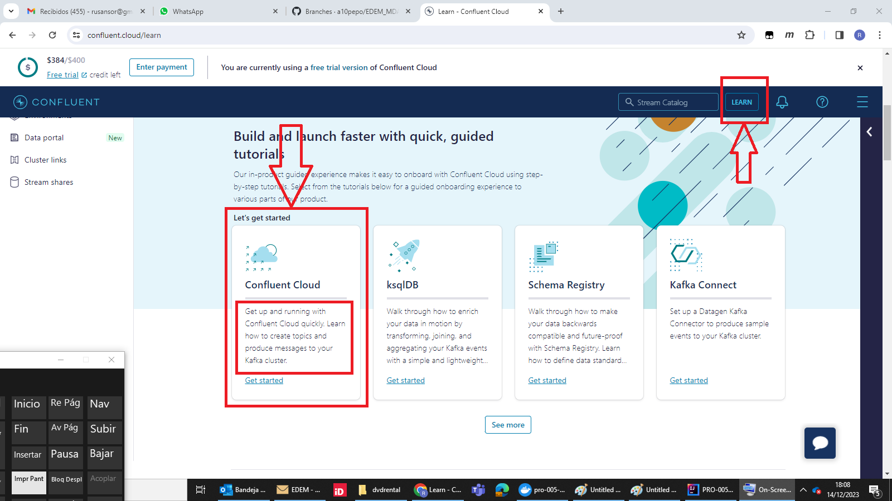

# Exercise 2: Confluent Kafka Cloud - Create a Kafka Topic and send messages.

# Taret
Create your first Kafka Topic, send messages to it manually. And create an automtic 
radom data generator of messages, which are sent to this Kafka Topic.

## Excersise
Click on Learn button and select first option "Confluent Cloud". Follow the tutorial.

