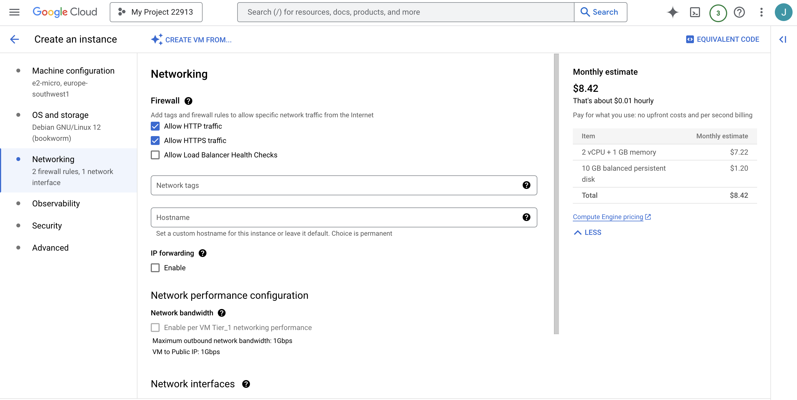
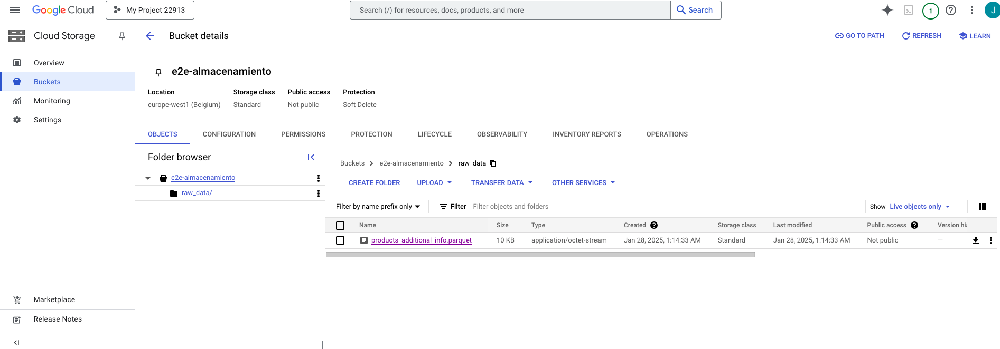
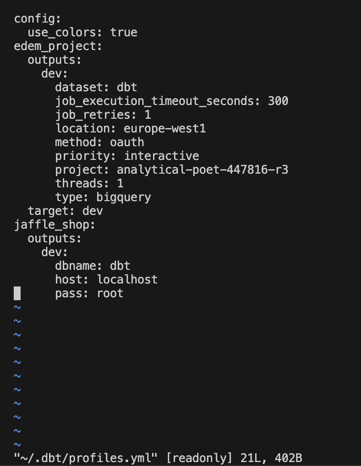

## End2End Almacenamiento Cloud

 -Arrancamos las maquinas donde ejecutaremos los scripts que crean los datos de orders y delivery. 
 -Primero creamos orders y configuramos una imagen con docker y python, y la segunda máquina la creo por comandos añadiendo la imagen ya creada.
 -Conficuramos las maquinas por igual concretando como region europe-southwest1-c(Madrid) y europe-west1-c(Bélgica), con un tipo de maquina E2 micro ambas. En Firewall permitimos HTTP y HTTPS.

-Una vez arrancadas las maquinas, procedo a hacer la configuración de la instancia de postgreSQL.

-Creación datasets en BigQuery y tablas.

-Tablas postgreSQL.

-PUB/SUB: topics y subscripciones

-El bucket para CLOUD Storage lo tengo creado del otro dia y se me olvidó hacerle captura.

-Arranco los scrits.

-Compruebo q los datos se están cargando en las bases de datos.

-Configuración parquet

-Ejecuto Script Python en local (analytical_layer.el_orders.main)

-DBT y BigQuery tablas

-METABASE

