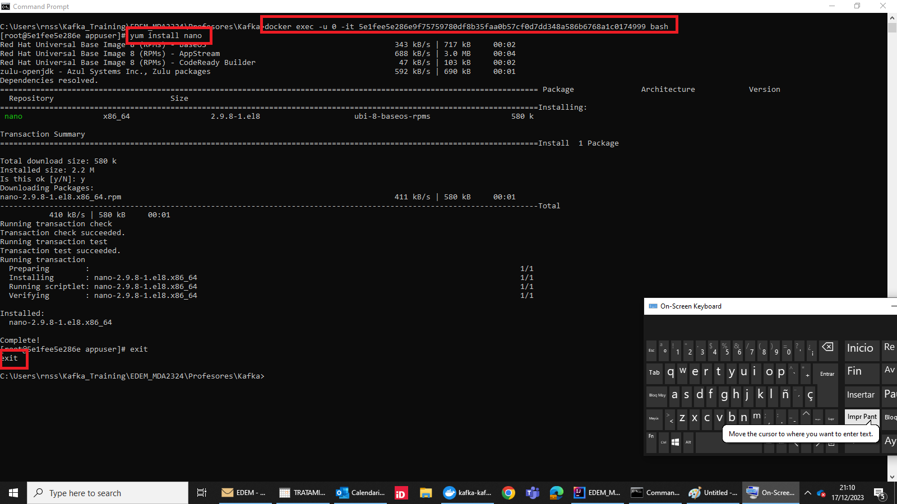
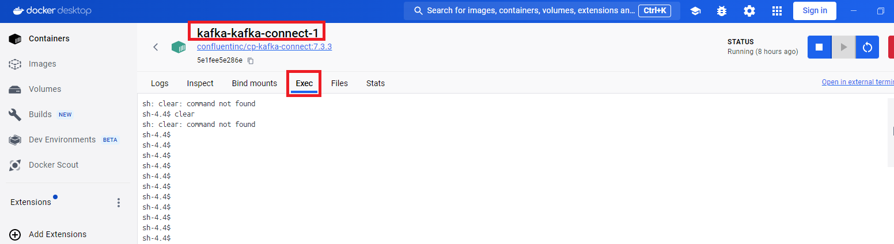
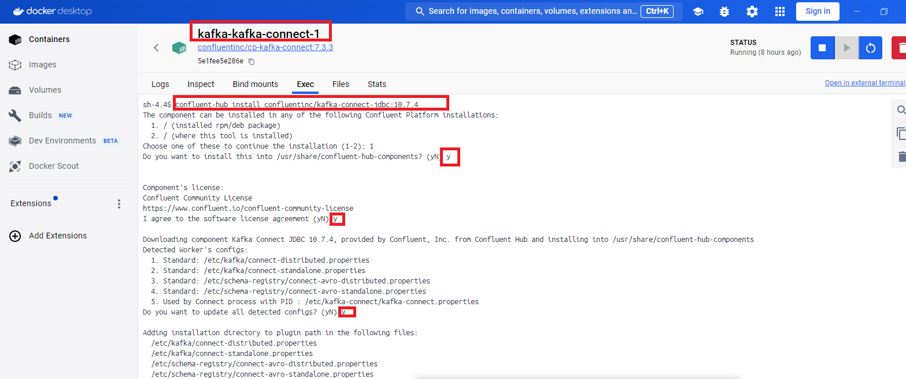
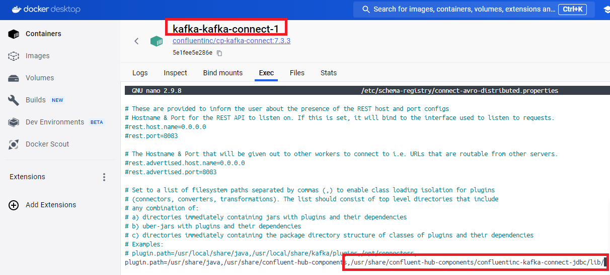
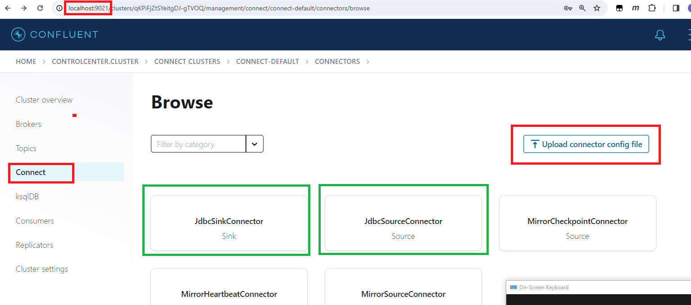
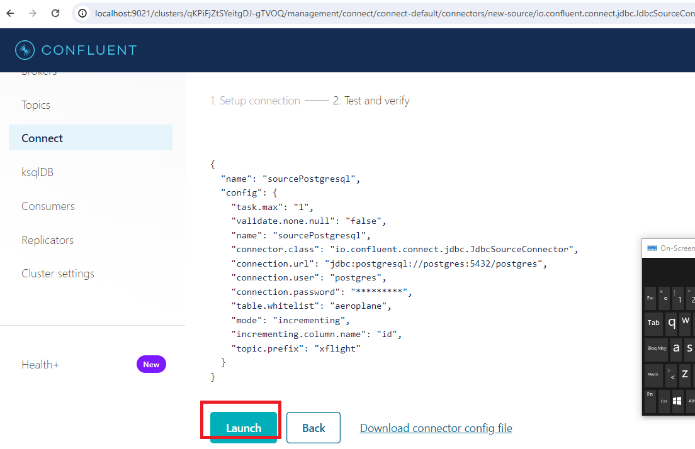
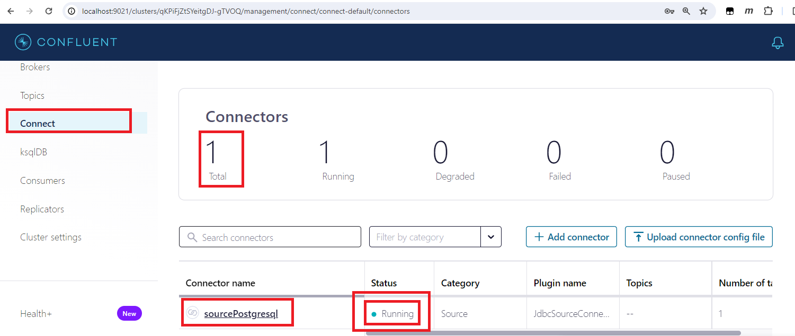
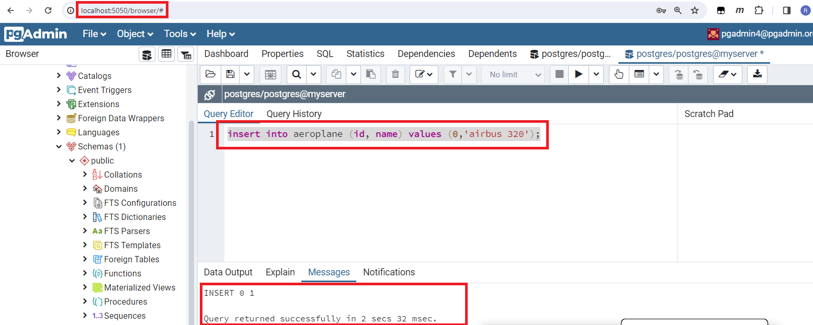
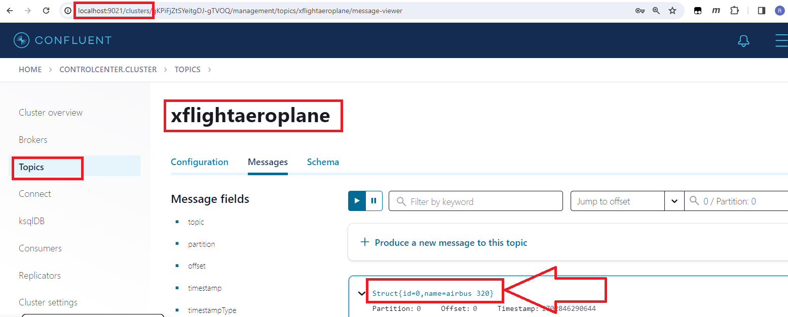

# Exercise 6: Kafka Connect

## Objectives

1) Use Postgresql as a source of data. So when you do an INSERT row into Posgresql, the new row is automatically 
sent and save into a Kafka topic, for its processing.

## Run Kafka in your computer with Docker
Simple scenario: 1 zookeeper + 1 Kafka broker.

Start the ZooKeeper and Kafka container.

```sh
$ docker-compose up -d
```

Status:

```sh
$ docker-compose ps
      Name                  Command            State                     Ports
-------------------------------------------------------------------------------------------------
lab1_kafka_1       /etc/confluent/docker/run   Up      0.0.0.0:9092->9092/tcp
lab1_zookeeper_1   /etc/confluent/docker/run   Up      0.0.0.0:2181->2181/tcp, 2888/tcp, 3888/tcp
```

## Set up the Docker Connect image

### Create a Postgresql database and table
Follow instruction at https://github.com/a10pepo/postgressetup to just create a new server with the a postgresql database.
Then create a new table named after "aeroplane". It must have an "id" int sequencer column and a "name" varchar column.
```sql
CREATE TABLE public.aeroplane
(
id bigint NOT NULL,
name character varying COLLATE pg_catalog."default",
CONSTRAINT aeroplane_pkey PRIMARY KEY (id)
)
````

### Install nano editor
From below command, change 5e1fee5e...by your Docker Coonect id process. You can find it with docker ps or with the Docker UI:
docker exec -u 0 -it 5e1fee5e286e9f75759780df8b35faa0b57cf0d7dd348a586b6768a1c0174999 bash
yum install nano
exit


### Install and configure the JDBC Kafka connector to connect to postgresql (it could be also used to connnect to MySql or Oracle databases)
Perform below instructions inside your Docker Connect instance


confluent-hub install confluentinc/kafka-connect-jdbc:10.7.4



nano   /etc/schema-registry/connect-avro-distributed.properties
Add /usr/share/confluent-hub-components/confluentinc-kafka-connect-jdbc/lib/ as value of the key "plugin.path". Use the 
separator ",".
When edited , type Control-X(in windows) or Command-X(in Mac) to save it.



Restart docker container

Then upload the file postgresqlSourceConnectConfig.json



And Launch it:


Check it is running OK:



Insert a new row into the database:
```sql
insert into aeroplane (id, name) values (0,'airbus 320');
```



Check the topic has been created and a new message inserted:


   