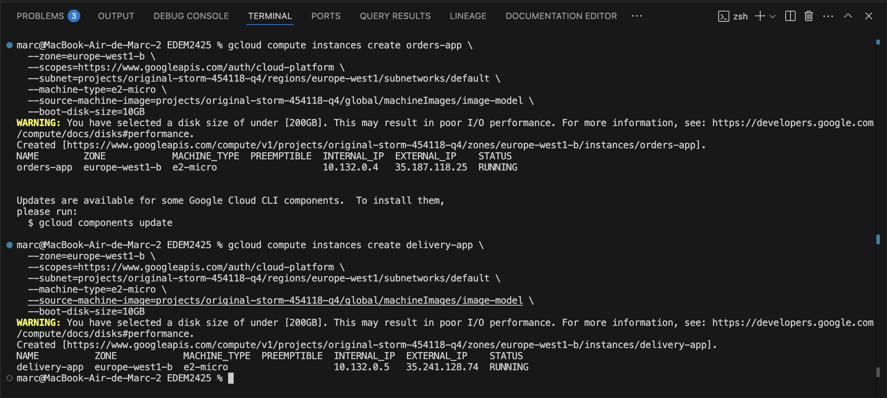

# End2End Miguel GCP

## Entregable End2End basic:

Esta arquitectura en GCP pretende simular lo que sería una arquitectura real de un e-commerce donde tendremos dos scripts de Python: `customers` y `delivery`, que estarán simulando en máquinas virtuales órdenes de compra y de entrega (respuesta). 

Además, podremos encontrar diferentes elementos como:

- **Cloud SQL**, que funciona como la base de datos operacional (OLTP),  
- Que a su vez comunica con otra base de datos en **BigQuery** que hará efectos de capa analítica (OLAP),  
- Que además conecta con **DBT**, donde generaremos varias vistas,  
- Las cuales luego podremos ver mediante la herramienta de BI **Metabase**, que hemos desplegado en local mediante una imagen de Docker.

---

### 1. Creamos las instancias de `orders-app` y `delivery-app` que estarán creando y leyendo órdenes de compra.

### 2. Creamos la instancia para la base de datos SQL.

### 3. Creamos el usuario y la base de datos para la base de datos operacional (Cloud SQL: Postgres).

### 4. Creamos los datasets en BigQuery para la capa analítica.  
En este caso he tenido que hacerlo de manera manual mediante la UI porque por algún motivo los comandos de `gcloud` me daban error con BQ y después de varios días intentando desistí.

### 5. Creamos las tablas de BigQuery.

### 6. Creamos los tópicos de Pub/Sub.

### 7. Creamos las suscripciones correspondientes.

### 8. Ahora con todo el ecosistema creado, vamos a ejecutar `orders` y `delivery` para empezar a generar datos.  
Para ello, primero entramos en la instancia de `orders-app` e instalamos `requirements.txt`.

### 9. Ejecutamos `orders-app` de manera que siga corriendo de fondo.

### 10. Hacemos lo mismo en una terminal diferente para `delivery-app`.

### 11. Vamos a sincronizar Postgres con BigQuery.  
Para ello ejecutamos el `main.py` que tenemos en `datalake/analytical_layer/el_orders` que hará a efectos de EL, cogiendo datos de Cloud SQL, haciendo pequeños cambios de schema e insertándolos en BQ.

### 12. Comprobamos que los datos se han insertado en BigQuery.

### 13. Creamos el proyecto de DBT que insertará vistas y leerá datos de las tablas de BigQuery.

### 14. Creamos la primera vista.

### 15. Creamos el resto de vistas analíticas.

### 16. Ejecutamos el `docker-compose` para lanzar Metabase.  
He tenido que modificarlo ya que me daba error con el tema del login. Por ello, he cogido en Docker Hub el `docker-compose` modelo (por decirlo así) para lanzar la imagen de Metabase. Ya sé que tiene también un Postgres, pero he preferido no tocarlo aunque no lo vayamos a usar.

### 17. Conectamos con BigQuery usando una key para mi service account (ya está borrada, no hay problema).

### 18. Por último, creamos el dashboard.
