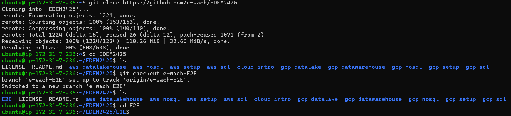
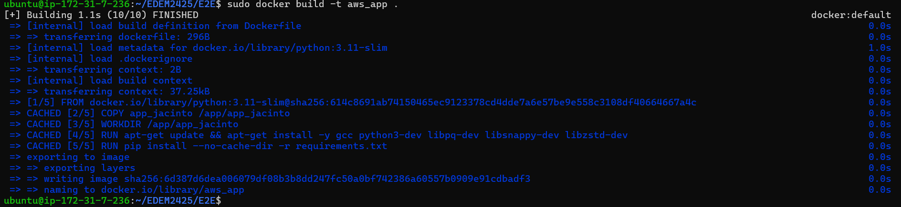
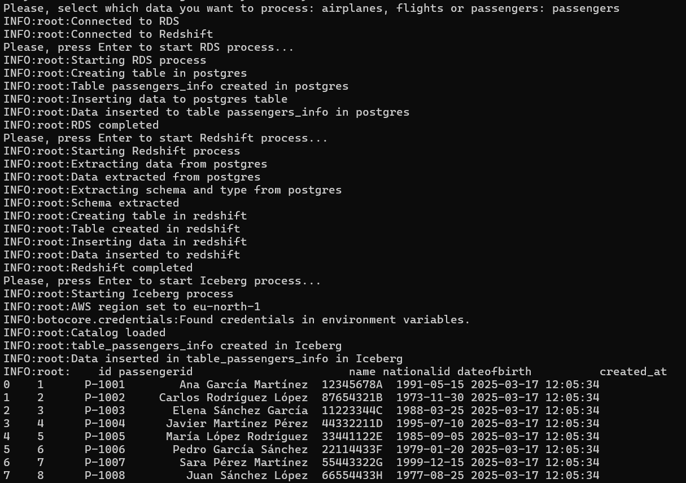
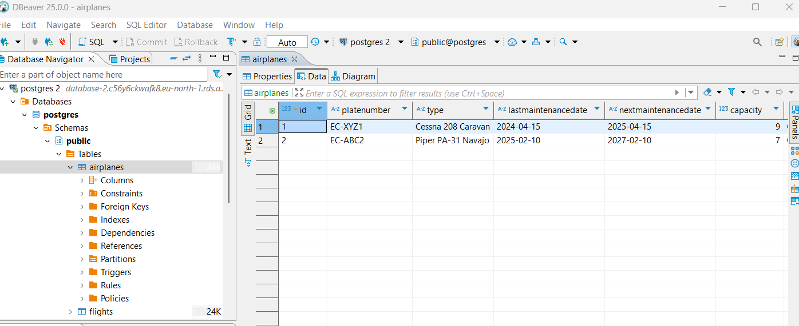
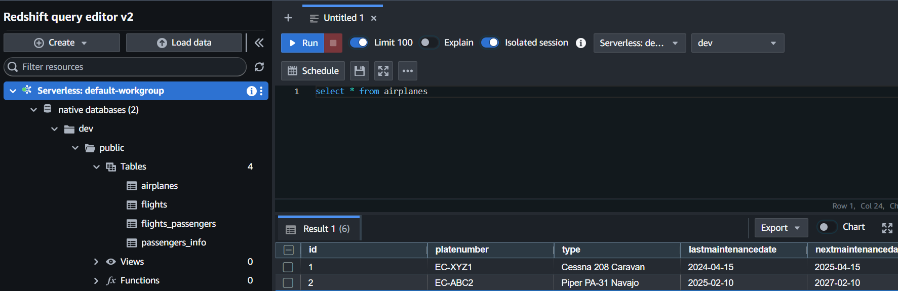
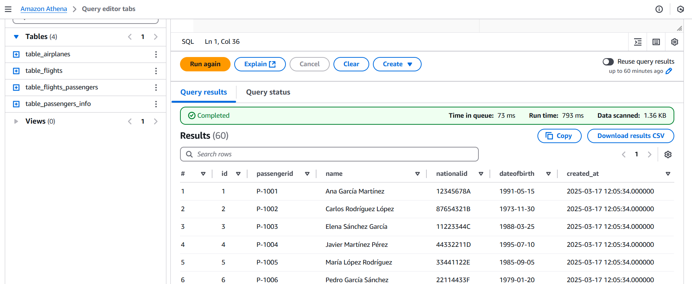
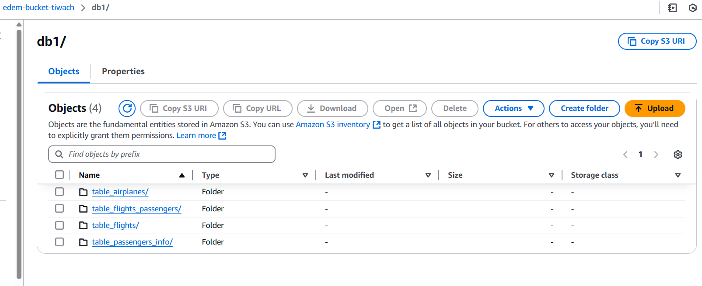

# AWS App for Jacinto's Aerodrome

This repository contains a Dockerized application that interacts with AWS services, including RDS, Redshift, and Iceberg. The app processes and manages data related to airplanes, flights, and passengers.

## Project Structure

- `aws_resources/` - Scripts for AWS resources (RDS, Redshift, and Iceberg).
- `data/` - Data source files.
- `data_processors/` - Scripts for processing data in AWS tables (airplanes, flights, passengers).
- `main.py` - Executes all data processors.
- `Dockerfile` - Docker configuration for the application.
- `.env` - Environment variables (not included in the repository):

  ```ini
  RDS_HOST=<rds_host>
  RDS_PORT=<port>
  RDS_USER=<user>
  RDS_PASSWORD=<password>
  RDS_DB=<database>

  REDSHIFT_HOST=<redshift_host>
  REDSHIFT_PORT=<port>
  REDSHIFT_USER=<user>
  REDSHIFT_PASSWORD=<password>
  REDSHIFT_DB=<database>

  AWS_REGION=<region>
  WAREHOUSE_BUCKET=s3://<bucket_name>/

  AWS_ACCESS_KEY_ID=<access_key>
  AWS_SECRET_ACCESS_KEY=<secret_access_key>
  ```

The project is organized into modules using `__init__.py` scripts.

---

## AWS Setup
### Deploying on an EC2 Instance

To deploy the app on AWS EC2:

1. **Launch an EC2 instance**
2. **Connect to the instance using AWS CLI**
3. **Clone the GitHub repository**
   ```sh
   git clone <repository_url>
   ```
4. **Navigate to the folder containing the `Dockerfile`**

   <p align="center">
   
   </p>

5. **Build the Docker image**
   ```sh
   sudo docker build -t <image_name> .
   ```
   <p align="center">
   
   </p>

6. **Run a Docker container**
   ```sh
   sudo docker run --name <container_name> -it \
     -e RDS_HOST=<rds_host> \
     -e RDS_PORT=<port> \
     -e RDS_USER=<user> \
     -e RDS_PASSWORD=<password> \
     -e RDS_DB=<database_name> \
     -e REDSHIFT_HOST=<redshift_host> \
     -e REDSHIFT_PORT=<port> \
     -e REDSHIFT_USER=<user> \
     -e REDSHIFT_PASSWORD=<password> \
     -e REDSHIFT_DB=<database_name> \
     -e AWS_REGION=<region> \
     -e WAREHOUSE_BUCKET=s3://<bucket_name>/ \
     -e AWS_ACCESS_KEY_ID=<access_key> \
     -e AWS_SECRET_ACCESS_KEY=<secret_access_key> \
     <image_name>
   ```
   **OR** use the `.env` file:
   ```sh
   sudo docker run --name <container_name> -it --env-file .env <image_name>
   ```

7. **The app will start running:**
   <p align="center">
   
   </p>

---

## AWS Services

### RDS
Stores structured data related to airplanes, flights, and passengers.

<p align="center">

</p>

### Redshift
Used for analytical processing of large datasets.

<p align="center">

</p>

### Iceberg & S3
Manages data in an optimized format for analytics.

<p align="center">


</p>
