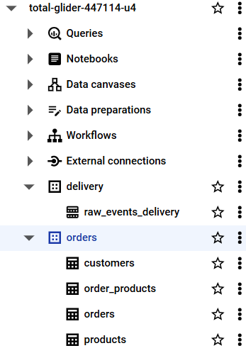

## 1. Create the architecture in GCP

### Compute Engine

-  Create the VM instances for `orders-app` and `delivery-app`:

### Cloud SQL

- Create SQL instance:

 

 

- Create database named `ecommerce`:
  

 

 

- Run queries to create tables in database `ecommerce`:
  

 

 

### BigQuery

- Create datasets `orders` and `delivery`:

 

 

-  Create tables by running queries:

 

 

### Pub/Sub

- Create topics `delivery-events` and `topic-events`:

 

 

 

- Configure subscription to BQ:

 

### Bucket

- Create bucket (.parquet available after step in section 2. Ejecution)

 

## 2. Ejectution

- Initiate and run (`nohup`) in both VM instances `orders-app` and `delivery-app` to send data to Postgres and the Bucket created previously:

 

### Analytical layer

- Definition of variables. Syncronization of Postgres with BigQuery:

 

## 3. DBT

- Configuration of dbt files to match our project's information.

 

- dbt run `expanded_delivery_events`:

 

- Datasets created by DBT in BigQuery, as result of the previous step:

 

## 4. Visualization - Metabase

- Through a docker-compose, we access to Metabase and load our datasets.
 

- Sample of dashboard:

