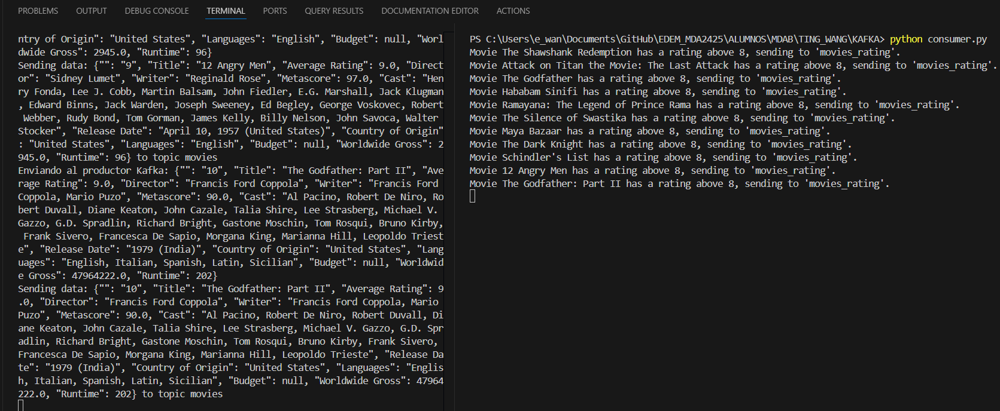
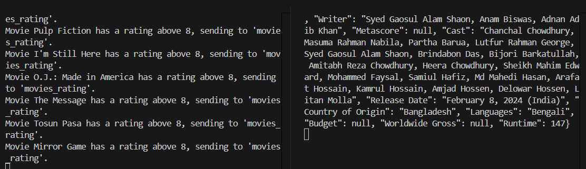
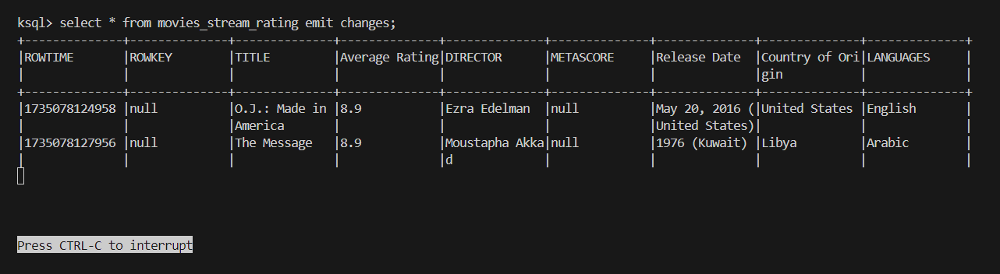
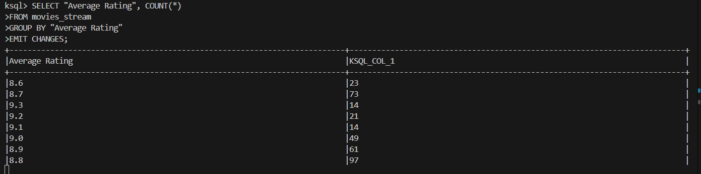

1. **USE CASE**
<br>
Esta aplicación procesa datos de películas registradas en IMDB en tiempo real para proporcionar análisis y reportes sobre atributos de las películas como por ejemplo ratings y país de origen. 
La aplicación permitirá a las empresas o consumidores obtener información sobre las preferencias y tendencias en el sector del entretenimiento. Se podrán sacar conclusiones como las películas más populares y mayor rendimiento, tendencias de los consumidores considerando sus opiniones y calificaciones,etc. Estos análisis podrán ayudar a mejorar las estrategias de márketing o mejorar la toma de deciisones sobre la adquisición de nuevos títulos (por ejemplo, para una empresa de streaming).

2. **DATASET SELECTED**
<br>
El dataset elegido es IMDB_Movies_Dataset.csv,transformado en json.

3. **ARCHITECTURE IMPLEMENTED**
<br>
Fuente de datos: Archivo CSV de películas (convertido en json)
Producer: Envía datos JSON al topic de Kafka movies_imdb
Consumer: recibe y lee los datos enviados por el producer. Procesa los datos y solo selecciona aquellas películas con un "Average Rating"> 8 y los envía a un nuevo topic (movies_rating).
KSQL: Procesa los datos del topic. Creación de un stream.
````
sql
CREATE STREAM movies_stream_rating ( 
    Title VARCHAR, 
    "Average Rating" DOUBLE, 
    Director VARCHAR, 
    Metascore DOUBLE, 
    "Release Date" VARCHAR, 
    "Country of Origin" VARCHAR, 
    Languages VARCHAR
    ) 
WITH (KAFKA_TOPIC = 'movies_rating', 
    VALUE_FORMAT = 'JSON');
````

4. **JSON EXAMPLES**
<br>
{
	"": "24",
	"Title": "Fight Club",
	"Average Rating": 8.8,
	"Director": "David Fincher",
	"Writer": "Chuck Palahniuk, Jim Uhls",
	"Metascore": 67.0,
	"Cast": "Brad Pitt, Edward Norton, Meat Loaf, Zach Grenier, Richmond Arquette, David Andrews, George Maguire, Eugenie Bondurant, Christina Cabot, Helena Bonham Carter, Sydney 'Big Dawg' Colston, Rachel Singer, Christie Cronenweth, Tim DeZarn, Ezra Buzzington, Dierdre Downing-Jackson, Bob Stephenson, Charlie Dell",
	"Release Date": "October 15, 1999 (India)",
	"Country of Origin": "Germany, United States",
	"Languages": "English",
	"Budget": null,
	"Worldwide Gross": 101321009.0,
	"Runtime": 139
}

1. **EVIDENCE**
<br>
(1, 2) Producer (left) and Consumer (right)

Consumer topic movies (left) and Consumer topic movies_rating (right)

(3) KSQL
<br>



