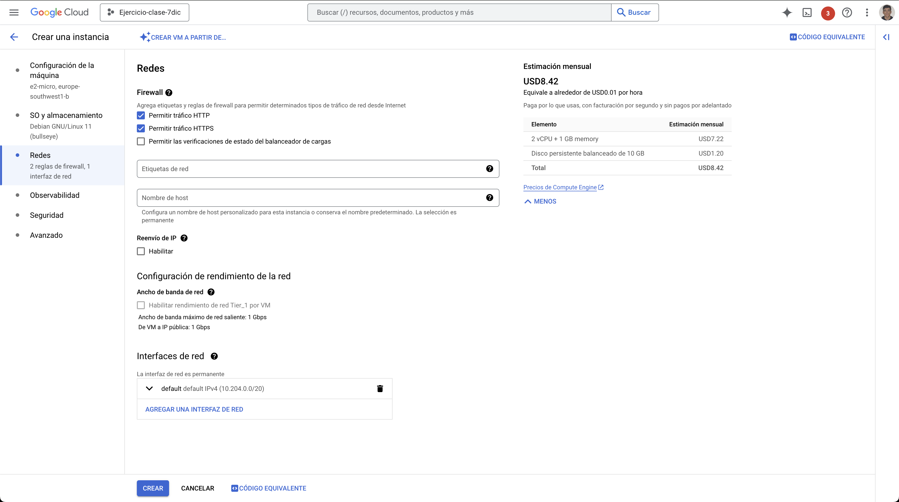
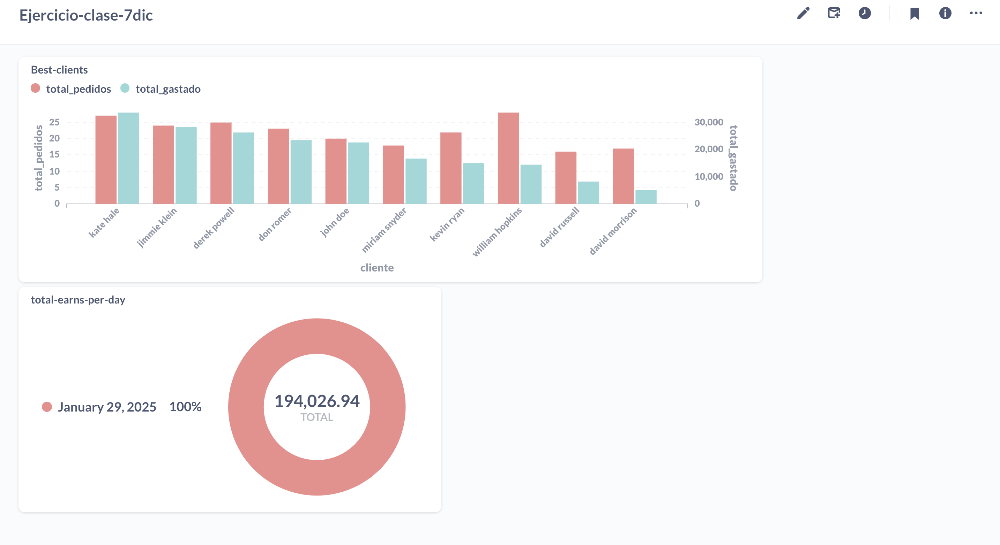

# Entregable de GCP_Almacenamiento 

- A lo largo de este documento veremos como se ha ido haciendo paso por paso el entregable y cuales han sido los servicios de GCP que se han utilizado. Además de anotaciones. 

### 1.- Crear las instancias virtuales 

- Hasta aqui hemos visto como se crea una máquina virtual y le hemos instalado Docker y tambien hemos decargado el repo del proyecto. 
    - De esta forma podemos correr los scripts y hacer que la máquina virtual haga su funcion de enviar los pedidos. 
--- 

- En este punto vemos que hemos creado una imagen de la máquina virtual, lo que conseguimos es que podemos desplegar ahora otra máquina virtual con tan solo un comando en la terminal. 
  - En nuestro caso será Delivery-app
  - hay dos imagenes, una de ellas es la que teniamos a lo largo de las clases que no fue utilizada en este trabajo (image-edem-template). 
  - la imagen que hemos utilizado y creado es image-edem-template-2 
--- 

- Ahora como podemos ver gracias a solo un comando en terminal creamos una máquina virtual con las mismas especificaciones que la anterior. 

---

### 2.- Crear los topicos de Pub/Sub 

- En la primera imagen vemos como hemos creado el topic de Pub-Sub llamada **order-events** y en las opciones hemos dejado las que GCP recomienda normalmente.
- para crear **delivery-events** hemos hecho el mismo proceso que en la creación del anterior topic 

--- 

### 3.- Crear la base de datos en Postgres

- Estos son los pasos requeridos para crear una base de datos Postgres en concreto Postgres16 y una Database (ecommerce) y cual ha sido la query para creer las tablas necesarias que vamos a utilizar en el ptoyecto.

--- 

### 4.- Creación en BigQuey de Datasets y tablas

- En esta parte vermos como hemos creado en BigQuery dos Datasets orders y delivery, asi como mediante querys hemos creado las tablas donde se ingestarán los datos 

- Esta es la imagen donde vemos la query que crea las tablas de delivery, pero también creamos las tablas de orders, pero no hice la captura de pantalla de ese paso 😅

---

### 5.- Enlazar BigQuery con Pub/Sub
  
- En este paso lo que vamos a hacer es enlazar Big Query con un topic de Pub/Sub par que se escriban los datos en las tablas y de esta forma poder hacer dashboards en el futuro 

---

### 6.- Creación del Data Lake

- En estos pasos de a continuación creamos un bucket en GCP 

---

### 7.- Ejecutamos los scripts 

- De esta forma lo que logramos es tener datos y tambien que la sincronización de Big Query y Postgres para que podamos tenerlos en ambas herramientas

---

### 8.- Comprobamos que tenemos los datos en Big Query 

- Este paso es necesario ya que tenemos que confirmar que todo esta correcto para que luego al hacer las vistas desde DBT y querer hacer dashboards tenemos que tener los datos en su correspondiente lugar.

---

### 9.- Hacemos vistas en DBT 

- Ejecutamos el script, después de cambiar algunos parametros y ajustarlo a nuestro trabajo ya que variaba un poco del último end_2_end que hicimos y listo. Comprobamos que esta todo bien y que las vistas se han ejecutado correctamente.

---

### 10.- Hacemos el dashboard con DBT 

- Para ello deberemos hacer una account service, y hacer una key en formato .json para que database desde docker se pueda conectar a Big Query y tomas los datasets que tenemos en el. De esta forma podremos entrar a las databases y hacer los dashboards

---
Y estos han sido todos los pasos documentados de como hemos llegado a la solución final del end to end propuesto. 

