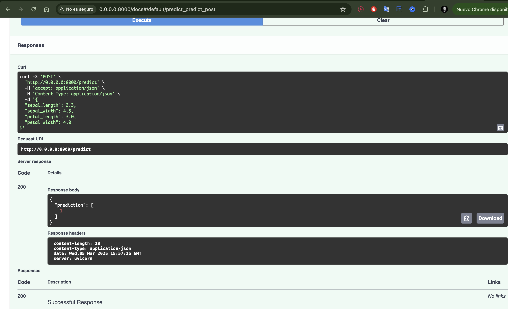
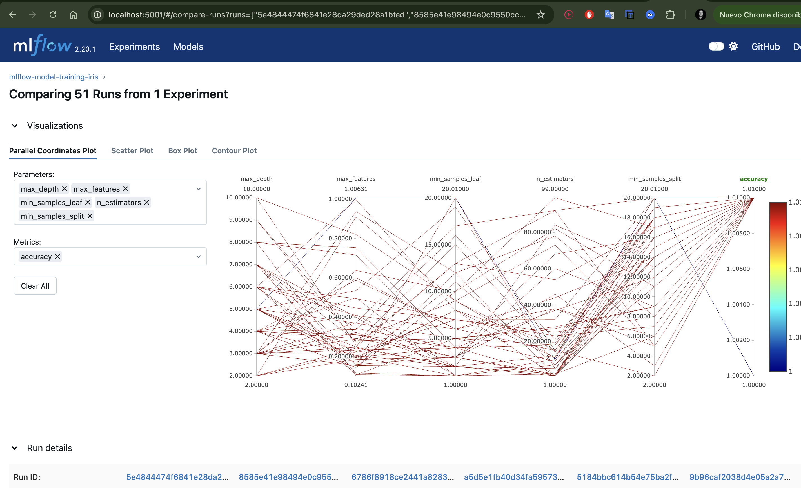
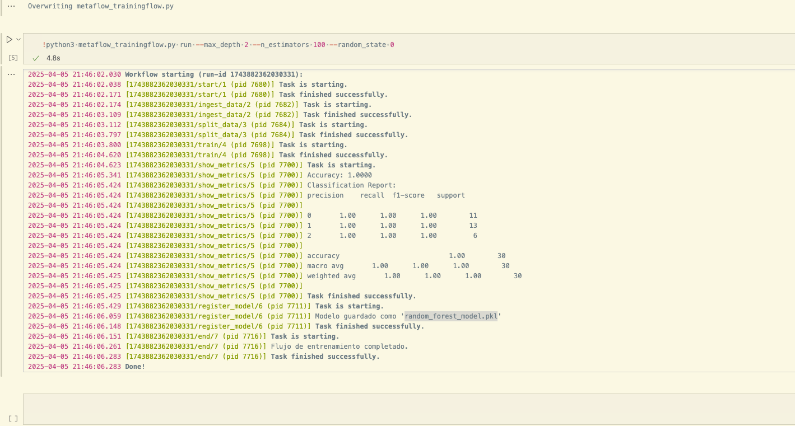

# Entregables de MLOps

Para entregar los ejercicios de MLOps, crea una rama en tu clon del repositorio, sube los cambios al repositorio y haz una pull request a la rama main añadiendo a Daniel Ruiz (daruai) como reviewer.

## Entregable 1
Servidores de inferencia: Crea una api rest con FastAPI que reciba un json con los datos de entrada y devuelva la predicción de un modelo de clasificación para el dataset de IRIS.
En clase trabajaremos sobre este dataset, pero siéntete libre de adaptarlo a cualquier otro dataset y tipo de modelo. Sigue los pasos que encontraras en la carpeta model-servers/fast-api-server/

Entregable: Entrega el código y una captura del swagger de la api rest desarrollada 

- Código en el archivo 'fastApi.py'

 

## Entregable 2
Model registry: Durante clase veremos como utilizar MLFlow para registrar modelos y compararlos utilizando el notebook model-registry/mlflow-training.ipynb. Se entrenará un modelo de clasificación para el dataset de IRIS utilizando optimización de hiperparámetros y se registraran modelos y resultados en MLFLOW.

Entregable: Captura de la interfaz de MLFlow con la comparativa entre modelos.

## Entregable 3
Pipeline de entrenamiento: En este ejercicio crearás el código de entrenamiento de un modelo de clasificación para el dataset de IRIS utilizando Metaflow. Para ello, sigue las instrucciones del notebook pipelines/metaflow-model-training.ipynb.

Entregable: Entrega el código y una captura de los logs de ejecución del pipeline de entrenamiento.

- código en metaflow-model-traningflow.py
  

