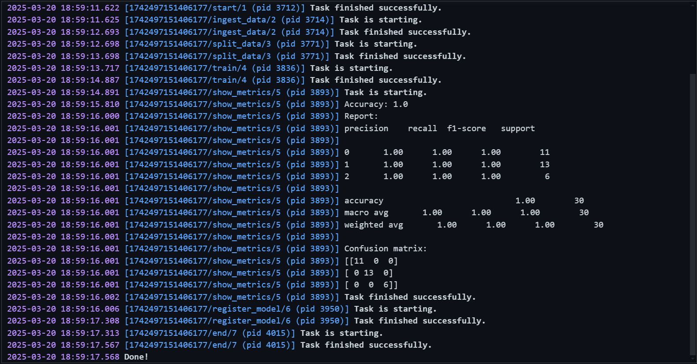

# Entregables de MLOps

Para entregar los ejercicios de MLOps, crea una rama en tu clon del repositorio, sube los cambios al repositorio y haz una pull request a la rama main añadiendo a Daniel Ruiz (daruai) como reviewer.

## Entregable 1

Servidores de inferencia: Crea una api rest con FastAPI que reciba un json con los datos de entrada y devuelva la predicción de un modelo de clasificación para el dataset de IRIS.
En clase trabajaremos sobre este dataset, pero siéntete libre de adaptarlo a cualquier otro dataset y tipo de modelo. Sigue los pasos que encontraras en la carpeta model-servers/fast-api-server/

Entregable: Entrega el código y una captura del swagger de la api rest desarrollada

## Entregable 2

Model registry: Durante clase veremos como utilizar MLFlow para registrar modelos y compararlos utilizando el notebook model-registry/mlflow-training.ipynb. Se entrenará un modelo de clasificación para el dataset de IRIS utilizando optimización de hiperparámetros y se registraran modelos y resultados en MLFLOW.

Entregable: Captura de la interfaz de MLFlow con la comparativa entre modelos.

## Entregable 3

Pipeline de entrenamiento: En este ejercicio crearás el código de entrenamiento de un modelo de clasificación para el dataset de IRIS utilizando Metaflow. Para ello, sigue las instrucciones del notebook pipelines/metaflow-model-training.ipynb.

Entregable: Entrega el código y una captura de los logs de ejecución del pipeline de entrenamiento.

Recuerda que para poder ejecutar metaflow necesitas un sistema basado en unix (Linux o MacOS), Google Colab o Windows con WSL2.

Contacto para cualquier duda: danielruizriquelme@gmail.com