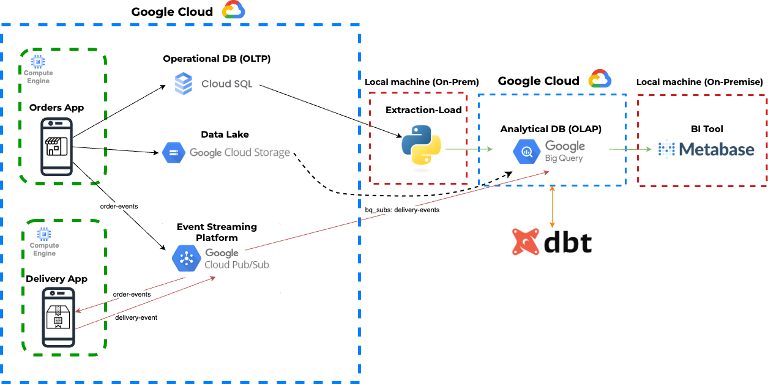
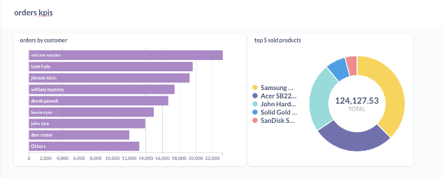
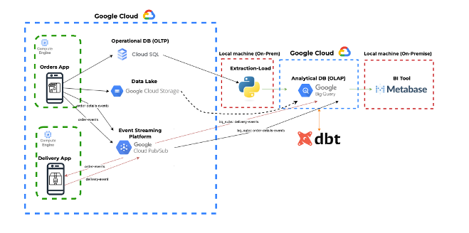
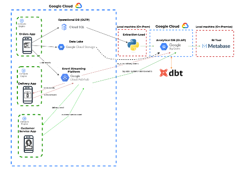
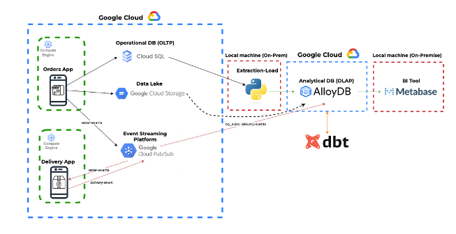

# Entregable End2End GCP Almacenamiento

## Descripción

Este entregable tiene como objetivo desplegar el end2end que hemos visto en clase. 

Para desplegar el end2end, hay que seguir los pasos que hemos ido viendo en cada clase para cada uno de los servicios.

1. Depliegue de `Orders App` y `Delivery App`. Seguir los pasos de la clase `gcp_setup`
2. Depliegue de topicos y subscriptores de `Pub/Sub`. Seguir los pasos de la clase `gcp_setup`.
3. Despliegue de `Cloud SQL`. Seguir los pasos de la clase `gcp_sql`.
4. Uso de `Google BigQuery`. Seguir los pasos de la clase `gcp_datawarehouse`.
5. Despliege del Data Lake. Seguir los pasos de la clase `gcp_datalake`.
6. Uso de DBT. Seguir los pasos de la clase `gcp_datalake`.

Para ejecutar el script the EL (Extract and Load) utilizar el de la clase del `gcp_datalake` ya que contiene todos los pasos para llevar los datos de la capa operacional a la capa analítica.

Por último, hay que desplegar Metabase en Local usando el docker_compose que se encuentra en la carpeta `analytical_layer`. Hay que conectar BigQuery a Metabase y crear los las question y dashboards que se enseñaron en la clase de `cloud_intro`.

Ejemplo de un dashboard en Metabase:

Cada paso se tiene que documentar con capturas de pantalla en explicación breve de cada paso en un Word.

## Propuestas adicionales

Hay 3 propuestas adicionales que se pueden hacer para mejorar el end2end y profundizar más en los conocimientos de GCP.

### Añadir un nuevo tópico y subscriptor en Pub/Sub desde Orders App

Modificar el código python de Orders App para que envíe un mensaje a un nuevo tópico en Pub/Sub. Crear un subscriptor que reciba los mensajes y los almacene en BigQuery.

### Añadir una nueva App en Python

Utilizar el código de alguna de las apps actualaes para crear una nueva (Ej: customer_service)

### Cambiar la BBDD de la capa analítica

Cambiar la BBDD de BigQuery a otro servicio de GCP como `Alloy DB`.

